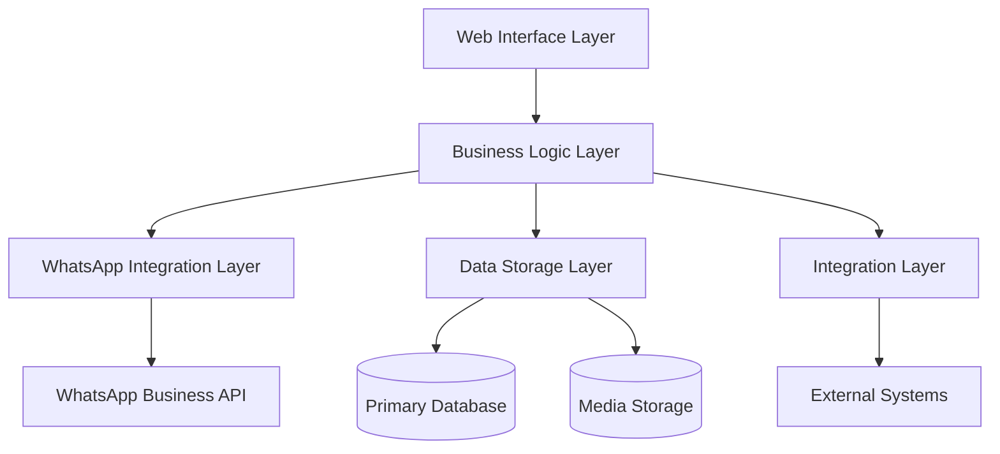

# WhatsApp Web Enhancement Application

[](https://github.com/org/whatsapp-web-enhancement/actions)
[](https://snyk.io/test/github/org/whatsapp-web-enhancement)
[](LICENSE)

Enterprise-grade WhatsApp management solution for business communication automation and analytics.

## 🚀 Features

- 📬 Secure bulk message management
- 📋 Template-based communication
- 🤖 Automated response system
- 👥 Advanced contact management
- 📊 Real-time analytics dashboard
- 🌍 Multi-region deployment support
- 🔒 Enterprise security compliance
- 📐 Scalable architecture

## 🏗️ Architecture



### Frontend
- **Technology**: React 18.2+, TypeScript 5.0+
- **Framework**: Material UI 5.14+
- **State Management**: Redux Toolkit 1.9+
- **Real-time**: WebSocket with fallback support

### Backend Services
- **API Gateway**: Node.js 20 LTS
- **Message Service**: Go 1.21+
- **Contact Service**: Python 3.11+
- **Analytics Service**: Python 3.11+
- **Template Service**: Node.js 20 LTS

### Infrastructure
- **Containerization**: Docker 24+
- **Orchestration**: Kubernetes 1.28+
- **Cloud Provider**: AWS EKS
- **Database**: PostgreSQL 15+
- **Cache**: Redis 7.2+
- **Storage**: MinIO RELEASE.2023-10-07

## 🔒 Security

- OAuth 2.0 authentication with JWT
- Role-based access control (RBAC)
- End-to-end encryption for messages
- Comprehensive audit logging
- Real-time compliance monitoring
- Regular security scanning
- Data encryption at rest and in transit

## 🚀 Quick Start

### Secure Installation
```bash
# Clone repository
git clone <repository-url>

# Navigate to project directory
cd whatsapp-web-enhancement

# Create environment configuration
cp .env.example .env

# Configure security settings in .env file
# Edit necessary environment variables

# Start services
docker-compose up -d
```

## 📚 Documentation

- [Backend Services](src/backend/README.md)
- [Frontend Application](src/web/README.md)
- [API Specifications](src/api/README.md)
- [Security Protocols](docs/security/README.md)

## 🏢 Enterprise Features

- Multi-tenant architecture
- Horizontal scaling capabilities
- High availability setup
- Disaster recovery support
- Performance monitoring
- Automated backups
- Rate limiting
- Load balancing

## 🔍 System Requirements

### Production Environment
- Kubernetes cluster with minimum 3 nodes
- Node size: t3.xlarge or equivalent
- Storage: 100GB+ per node
- Network: 1Gbps minimum bandwidth

### Development Environment
- Docker Desktop 24+
- 16GB RAM minimum
- 4 CPU cores minimum
- 50GB available storage

## 📊 Performance Metrics

- Message delivery rate: >99%
- System response time: <2 seconds
- Support for 1000+ concurrent users
- 99.9% system uptime
- Real-time analytics processing

## 🤝 Contributing

Please read our [Contributing Guidelines](CONTRIBUTING.md) before submitting pull requests.

## 🔐 Security

For security concerns, please email security@organization.com. Do not create public issues for security vulnerabilities.

## 📄 License

This project is licensed under the MIT License - see the [LICENSE](LICENSE) file for details.

## 📞 Support

Enterprise support is available 24/7 through:
- Email: support@organization.com
- Phone: +1-XXX-XXX-XXXX
- Support Portal: https://support.organization.com

---

Built with ❤️ for enterprise communication needs