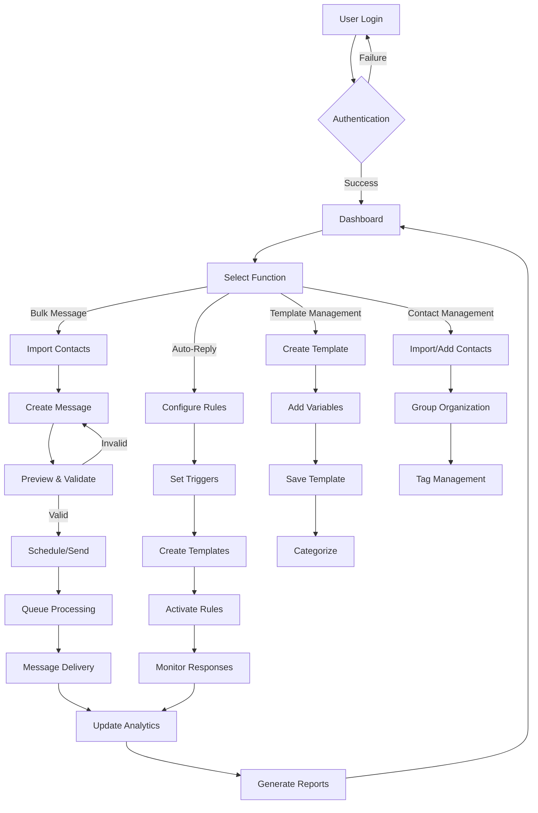
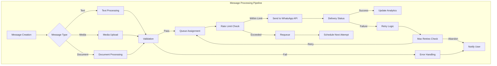
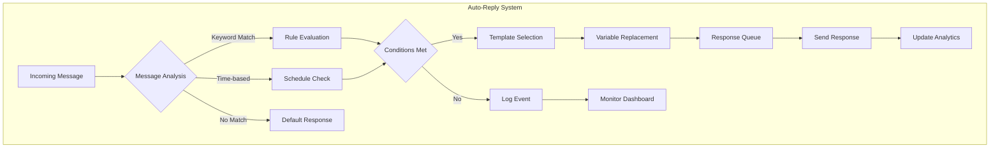
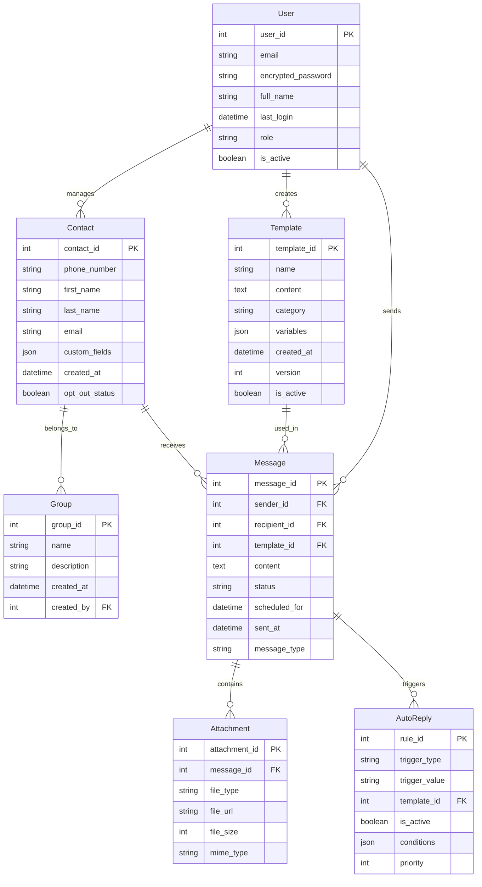
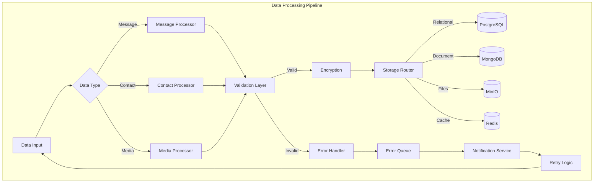
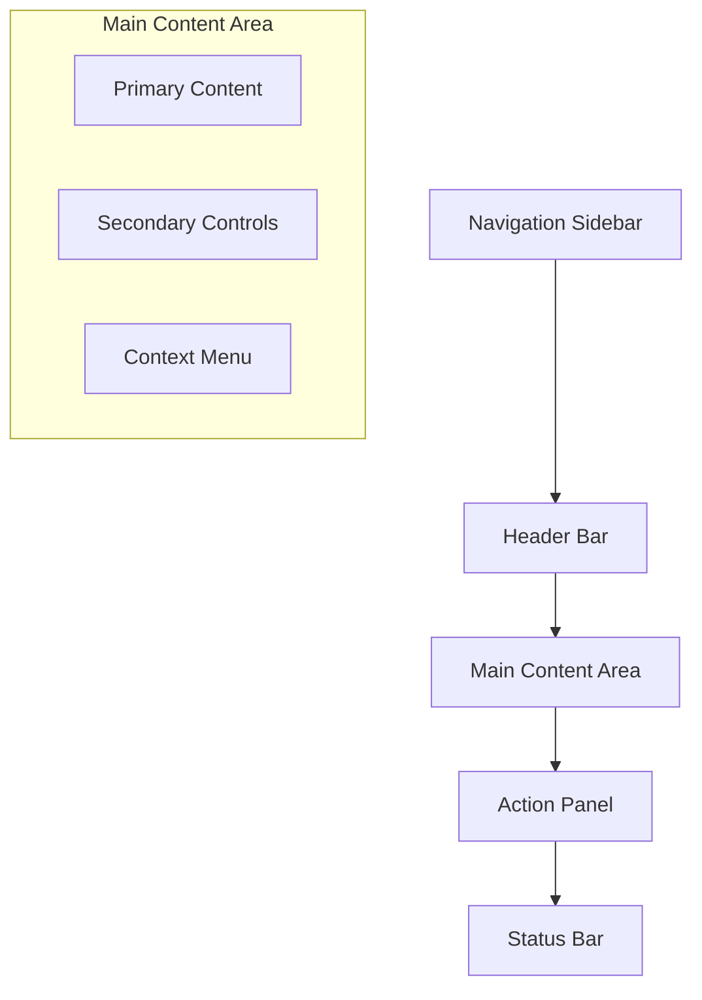

# Product Requirements Document (PRD)

# 1. INTRODUCTION

## 1.1 Purpose

This Software Requirements Specification (SRS) document provides a comprehensive description of the WhatsApp Web Enhancement Application. It is intended for:
- Development teams responsible for implementing the system
- Project managers overseeing the development process
- Quality assurance teams conducting testing
- Stakeholders evaluating project requirements
- System administrators who will maintain the application
- Technical writers creating documentation

## 1.2 Scope

The WhatsApp Web Enhancement Application is a web-based system that extends WhatsApp Web's native functionality through the following core components:

### 1.2.1 Product Features
- Bulk message management system with CSV/Excel import capabilities
- Advanced message composition tools with template management
- Automated response system with customizable rules
- Contact group management and organization
- Message scheduling and queuing system
- Rich media handling for various message types

### 1.2.2 Benefits
- Increased efficiency in managing large-scale messaging operations
- Improved message organization and templating capabilities
- Automated handling of routine communications
- Enhanced contact management and grouping
- Detailed analytics and tracking capabilities
- Streamlined business communication workflows

### 1.2.3 System Integration
- WhatsApp Business API integration
- CRM system connectivity
- Calendar system integration
- Cloud storage services
- Analytics platforms
- External webhook support

### 1.2.4 Constraints
- WhatsApp API rate limits and usage restrictions
- Message content policy compliance requirements
- Data protection and privacy regulations
- System resource limitations
- API quota management
- User authentication requirements

# 2. PRODUCT DESCRIPTION

## 2.1 Product Perspective
The WhatsApp Web Enhancement Application operates as a complementary layer to the existing WhatsApp Web platform, extending its native capabilities while maintaining seamless integration. The system architecture consists of:

- A web-based frontend interface that overlays WhatsApp Web
- A backend server managing business logic and data processing
- Integration with WhatsApp Business API for message handling
- External service connections for CRM, calendar, and storage systems
- Database systems for contact and message management
- Message queue infrastructure for bulk operations

## 2.2 Product Functions
The core functions of the system include:

1. Message Management
   - Bulk message composition and distribution
   - Template-based message creation
   - Message scheduling and queuing
   - Multi-format message support (text, media, documents)

2. Contact Administration
   - Contact import and organization
   - Group creation and management
   - Contact segmentation and tagging
   - Distribution list maintenance

3. Automation Features
   - Rule-based auto-responses
   - Time-triggered messages
   - Keyword-based interactions
   - Queue management

4. Analytics and Reporting
   - Message delivery tracking
   - Engagement metrics
   - Performance analytics
   - Custom report generation

## 2.3 User Characteristics

### Business Administrator
- Technical proficiency: Intermediate
- Primary tasks: System configuration, user management, permission settings
- Usage frequency: Daily
- Key requirements: Administrative dashboard, security controls

### Marketing Manager
- Technical proficiency: Basic to Intermediate
- Primary tasks: Campaign creation, template management, analytics review
- Usage frequency: Regular (3-5 times per week)
- Key requirements: Template builder, scheduling interface

### Customer Service Representative
- Technical proficiency: Basic
- Primary tasks: Message handling, auto-reply configuration
- Usage frequency: Continuous during work hours
- Key requirements: Quick response tools, contact management

### System Integration Specialist
- Technical proficiency: Advanced
- Primary tasks: API integration, webhook configuration
- Usage frequency: Periodic
- Key requirements: Technical documentation, API access

## 2.4 Constraints

### Technical Constraints
- WhatsApp API rate limits: 1000 messages per day per number
- Maximum message size: 64KB for text, 16MB for media
- Supported file formats: PDF, DOC, DOCX, XLS, XLSX
- Browser compatibility: Chrome 80+, Firefox 75+, Safari 13+
- Minimum internet speed: 1Mbps upload/download

### Business Constraints
- WhatsApp Business API pricing structure
- Service level agreements (99.9% uptime)
- Maximum concurrent users: 1000
- Storage limitations: 1TB per organization

### Regulatory Constraints
- GDPR compliance requirements
- Data retention policies
- Message consent management
- Privacy protection measures

## 2.5 Assumptions and Dependencies

### Assumptions
- Users have active WhatsApp Business accounts
- Stable internet connectivity is available
- Users have basic computer literacy
- Browser notifications are enabled
- System access is primarily from desktop devices

### Dependencies
- WhatsApp Business API availability
- Third-party service uptime:
  - Cloud storage providers
  - CRM systems
  - Calendar services
- SSL certificate maintenance
- Database backup systems
- Content delivery networks

# 3. PROCESS FLOWCHART







# 4. FUNCTIONAL REQUIREMENTS

## 4.1 Bulk Message Management

### ID: FR-BM-001
### Description
System must provide functionality to import, compose, and send messages to multiple recipients simultaneously.
### Priority: High

| Requirement ID | Requirement Description | Priority |
|---------------|------------------------|----------|
| FR-BM-101 | Import contact lists from CSV/Excel files with field mapping | High |
| FR-BM-102 | Support bulk message scheduling with date/time selection | High |
| FR-BM-103 | Preview bulk messages before sending | High |
| FR-BM-104 | Track delivery status for each message in bulk send | High |
| FR-BM-105 | Handle media attachments up to 16MB | Medium |
| FR-BM-106 | Implement retry mechanism for failed messages | Medium |
| FR-BM-107 | Support message queue management with pause/resume | Medium |

## 4.2 Message Composition Tools

### ID: FR-MC-002
### Description
Comprehensive message creation and template management system with rich editing capabilities.
### Priority: High

| Requirement ID | Requirement Description | Priority |
|---------------|------------------------|----------|
| FR-MC-201 | Rich text editor with formatting options | High |
| FR-MC-202 | Template library with categorization | High |
| FR-MC-203 | Dynamic variable insertion ({first_name}, {company}) | High |
| FR-MC-204 | Draft saving and auto-save functionality | Medium |
| FR-MC-205 | Template version control and history | Medium |
| FR-MC-206 | Media attachment preview | Medium |
| FR-MC-207 | Template performance analytics | Low |

## 4.3 Auto-Reply System

### ID: FR-AR-003
### Description
Automated response system with rule-based message handling and queue management.
### Priority: High

| Requirement ID | Requirement Description | Priority |
|---------------|------------------------|----------|
| FR-AR-301 | Keyword-based trigger configuration | High |
| FR-AR-302 | Time-based response rules | High |
| FR-AR-303 | Custom condition builder for responses | High |
| FR-AR-304 | Response template management | Medium |
| FR-AR-305 | Queue priority configuration | Medium |
| FR-AR-306 | Response analytics dashboard | Medium |
| FR-AR-307 | Blacklist/whitelist management | Low |

## 4.4 Contact Management

### ID: FR-CM-004
### Description
Contact organization and group management system with tagging capabilities.
### Priority: High

| Requirement ID | Requirement Description | Priority |
|---------------|------------------------|----------|
| FR-CM-401 | Contact import with duplicate detection | High |
| FR-CM-402 | Group creation and management | High |
| FR-CM-403 | Contact tagging and categorization | High |
| FR-CM-404 | Contact search and filtering | Medium |
| FR-CM-405 | Contact history tracking | Medium |
| FR-CM-406 | Export contact lists with selected fields | Medium |
| FR-CM-407 | Contact merge functionality | Low |

## 4.5 Analytics and Reporting

### ID: FR-AR-005
### Description
Comprehensive analytics system for tracking message performance and user engagement.
### Priority: Medium

| Requirement ID | Requirement Description | Priority |
|---------------|------------------------|----------|
| FR-AR-501 | Message delivery rate tracking | High |
| FR-AR-502 | Template performance metrics | High |
| FR-AR-503 | Custom report generation | Medium |
| FR-AR-504 | Export reports in multiple formats | Medium |
| FR-AR-505 | Real-time analytics dashboard | Medium |
| FR-AR-506 | Scheduled report delivery | Low |
| FR-AR-507 | Advanced data visualization | Low |

## 4.6 Integration Management

### ID: FR-IM-006
### Description
External system integration capabilities and API management.
### Priority: Medium

| Requirement ID | Requirement Description | Priority |
|---------------|------------------------|----------|
| FR-IM-601 | WhatsApp Business API integration | High |
| FR-IM-602 | CRM system connectivity | High |
| FR-IM-603 | Calendar system integration | Medium |
| FR-IM-604 | Cloud storage service integration | Medium |
| FR-IM-605 | Webhook configuration interface | Medium |
| FR-IM-606 | API usage monitoring | Medium |
| FR-IM-607 | Custom integration development | Low |

# 5. NON-FUNCTIONAL REQUIREMENTS

## 5.1 Performance Requirements

| Requirement ID | Description | Target Metric |
|---------------|-------------|---------------|
| NFR-P-101 | System response time for standard operations | < 2 seconds |
| NFR-P-102 | Bulk message processing throughput | 1000 messages/minute |
| NFR-P-103 | Maximum concurrent users supported | 1000 users |
| NFR-P-104 | API request handling capacity | 100 requests/second |
| NFR-P-105 | Message template loading time | < 1 second |
| NFR-P-106 | Database query response time | < 500ms |
| NFR-P-107 | File upload processing time (up to 16MB) | < 30 seconds |

## 5.2 Safety Requirements

| Requirement ID | Description | Implementation |
|---------------|-------------|----------------|
| NFR-S-201 | Automated backup system | Daily incremental, weekly full backup |
| NFR-S-202 | Data recovery time objective (RTO) | < 4 hours |
| NFR-S-203 | Recovery point objective (RPO) | < 1 hour data loss |
| NFR-S-204 | System state monitoring | Real-time monitoring with alerts |
| NFR-S-205 | Failover capability | Automatic failover to backup systems |
| NFR-S-206 | Data corruption prevention | Checksums and validation |
| NFR-S-207 | Emergency shutdown procedure | Graceful shutdown with data preservation |

## 5.3 Security Requirements

| Requirement ID | Description | Specification |
|---------------|-------------|---------------|
| NFR-SE-301 | User authentication | Multi-factor authentication |
| NFR-SE-302 | Data encryption at rest | AES-256 encryption |
| NFR-SE-303 | Data encryption in transit | TLS 1.3 |
| NFR-SE-304 | Access control | Role-based access control (RBAC) |
| NFR-SE-305 | Session management | 30-minute timeout, secure tokens |
| NFR-SE-306 | Password policy | Min 12 chars, complexity requirements |
| NFR-SE-307 | Security audit logging | Complete audit trail of all actions |

## 5.4 Quality Requirements

### 5.4.1 Availability
- System uptime: 99.9% excluding planned maintenance
- Planned maintenance window: Maximum 4 hours monthly
- Maximum unplanned downtime: 43.8 minutes/month

### 5.4.2 Maintainability
- Code documentation coverage: Minimum 80%
- Modular architecture with clear separation of concerns
- Automated testing coverage: Minimum 85%
- Standard coding conventions and style guides

### 5.4.3 Usability
- Maximum 3 clicks to reach any feature
- Interface response feedback within 200ms
- Consistent UI/UX patterns across all modules
- Support for multiple languages and locales

### 5.4.4 Scalability
- Horizontal scaling capability up to 10,000 concurrent users
- Database partitioning for datasets exceeding 1TB
- Auto-scaling based on resource utilization
- Load balancing across multiple servers

### 5.4.5 Reliability
- Mean Time Between Failures (MTBF): > 720 hours
- Mean Time To Repair (MTTR): < 2 hours
- Error rate: < 0.1% of all operations
- Data consistency check mechanisms

## 5.5 Compliance Requirements

| Requirement ID | Description | Standard/Regulation |
|---------------|-------------|-------------------|
| NFR-C-501 | GDPR compliance | EU GDPR 2016/679 |
| NFR-C-502 | WhatsApp Business Solution Terms | WhatsApp Business Policy |
| NFR-C-503 | Data protection standards | ISO/IEC 27001:2013 |
| NFR-C-504 | Accessibility compliance | WCAG 2.1 Level AA |
| NFR-C-505 | Privacy policy implementation | CCPA, PIPEDA |
| NFR-C-506 | Security standards | OWASP Top 10 |
| NFR-C-507 | Data retention policies | Industry-specific regulations |

# 6. DATA REQUIREMENTS

## 6.1 Data Models



## 6.2 Data Storage

### 6.2.1 Primary Storage
- PostgreSQL database cluster for relational data
- Redis for caching and session management
- MongoDB for message history and analytics data
- MinIO for media file storage

### 6.2.2 Data Retention
| Data Type | Retention Period | Storage Location |
|-----------|-----------------|------------------|
| Messages | 90 days | MongoDB |
| Templates | Indefinite | PostgreSQL |
| Contact Data | Active + 2 years | PostgreSQL |
| Media Files | 30 days | MinIO |
| Audit Logs | 1 year | MongoDB |
| Analytics Data | 2 years | MongoDB |

### 6.2.3 Backup Strategy
- Daily incremental backups of all databases
- Weekly full backups
- Real-time replication to standby servers
- Cross-region backup storage
- 30-day backup retention
- Monthly backup verification tests

### 6.2.4 Recovery Procedures
- Point-in-time recovery capability
- Automated failover to standby servers
- Recovery time objective (RTO): 4 hours
- Recovery point objective (RPO): 1 hour
- Documented recovery playbooks
- Monthly recovery testing

## 6.3 Data Processing



### 6.3.1 Data Security
- AES-256 encryption for data at rest
- TLS 1.3 for data in transit
- Field-level encryption for sensitive data
- Key rotation every 90 days
- Encrypted backup storage
- Data masking for non-production environments

### 6.3.2 Data Processing Rules
| Process Type | Rate Limit | Batch Size | Priority |
|-------------|------------|------------|-----------|
| Bulk Import | 10,000/hour | 1,000 records | Normal |
| Message Processing | 1,000/minute | 100 messages | High |
| Media Upload | 100/minute | 10 files | Low |
| Contact Sync | 5,000/hour | 500 records | Normal |
| Analytics Processing | Unlimited | 5,000 records | Low |

### 6.3.3 Data Validation
- Phone number format validation
- Email format verification
- File size and type validation
- Content policy compliance check
- Duplicate detection
- Data integrity verification
- Schema validation

### 6.3.4 Data Transformation
- Contact data normalization
- Message template variable substitution
- Media file optimization
- Time zone conversion
- Character encoding standardization
- Data format conversion for exports

# 7. EXTERNAL INTERFACES

## 7.1 User Interfaces

### 7.1.1 General Requirements
- Responsive web interface supporting desktop (1920x1080) and tablet (1024x768) resolutions
- WCAG 2.1 Level AA compliance for accessibility
- Support for dark/light themes with system preference detection
- Maximum 3-click navigation to any feature
- Consistent Material Design 3.0 implementation

### 7.1.2 Core Interface Components

| Component | Description | Key Features |
|-----------|-------------|--------------|
| Dashboard | Main control center | Real-time metrics, quick actions, notification center |
| Message Composer | Rich text editing interface | Template selector, variable insertion, media upload |
| Contact Manager | Contact database interface | List/grid views, filtering, bulk actions |
| Template Library | Template management system | Categories, search, version history |
| Analytics Panel | Data visualization interface | Interactive charts, custom report builder |
| Settings Console | System configuration interface | Profile management, integration setup |

### 7.1.3 Interface Layout



## 7.2 Hardware Interfaces

### 7.2.1 Client Hardware Requirements
- CPU: Modern dual-core processor (2.0 GHz+)
- RAM: 4GB minimum, 8GB recommended
- Storage: 1GB free space for cache
- Network: 1Mbps stable internet connection
- Display: 1024x768 minimum resolution
- Webcam: Required for QR code scanning

### 7.2.2 Server Hardware Requirements
- CPU: 8 cores minimum
- RAM: 16GB minimum
- Storage: SSD with 500GB minimum
- Network: 1Gbps dedicated connection
- Redundant power supply
- RAID configuration for storage

## 7.3 Software Interfaces

### 7.3.1 External Service Integration

| Service | Protocol | Data Format | Purpose |
|---------|----------|-------------|----------|
| WhatsApp Business API | REST/WebSocket | JSON | Message handling |
| PostgreSQL | TCP/IP | Binary | Primary data storage |
| Redis | TCP | Binary | Caching, queues |
| MongoDB | TCP/IP | BSON | Analytics storage |
| MinIO | HTTP/S3 | Binary | Media storage |

### 7.3.2 Third-Party Integration

| System | Integration Type | Authentication |
|--------|-----------------|----------------|
| CRM Systems | REST API | OAuth 2.0 |
| Calendar Services | CalDAV | API Key |
| Cloud Storage | S3/REST | IAM/API Key |
| Analytics Platforms | REST API | Bearer Token |
| Payment Gateways | REST API | API Key + Secret |

## 7.4 Communication Interfaces

### 7.4.1 Network Protocols
- HTTPS (TLS 1.3) for web traffic
- WebSocket for real-time updates
- SMTP for email notifications
- AMQP for message queuing
- gRPC for internal services

### 7.4.2 API Specifications

| Endpoint Type | Format | Rate Limit | Authentication |
|--------------|--------|------------|----------------|
| REST APIs | JSON | 100 req/min | JWT |
| WebSocket | Binary/JSON | 1000 msg/min | Token-based |
| Webhooks | JSON | 50 req/min | HMAC |
| File Transfer | Multipart | 100MB/min | Bearer Token |
| GraphQL | JSON | 60 req/min | OAuth 2.0 |

### 7.4.3 Data Exchange Formats

```json
{
  "message": {
    "type": "text|media|document",
    "content": "string",
    "metadata": {
      "timestamp": "ISO8601",
      "sender": "string",
      "recipient": "string",
      "status": "string"
    },
    "attachments": [{
      "type": "string",
      "url": "string",
      "size": "number"
    }]
  }
}
```

# 8. APPENDICES

## 8.1 GLOSSARY

| Term | Definition |
|------|------------|
| Bulk Message | A single message sent simultaneously to multiple recipients |
| Template | Pre-defined message format with customizable variables |
| Auto-Reply | Automated response triggered by specific conditions or keywords |
| Webhook | HTTP callback that delivers data to other applications in real-time |
| Rate Limit | Maximum number of requests allowed within a specified time period |
| Queue | System for managing message processing order and delivery |
| Rich Text | Text content with formatting options like bold, italic, and links |
| Distribution List | Grouped set of contacts for bulk message targeting |
| Media Message | Message containing images, audio, video, or documents |
| Opt-out | User's choice to stop receiving messages |

## 8.2 ACRONYMS

| Acronym | Expansion |
|---------|-----------|
| API | Application Programming Interface |
| BSON | Binary JSON |
| CCPA | California Consumer Privacy Act |
| CRM | Customer Relationship Management |
| GDPR | General Data Protection Regulation |
| HMAC | Hash-based Message Authentication Code |
| IAM | Identity and Access Management |
| JWT | JSON Web Token |
| MTBF | Mean Time Between Failures |
| MTTR | Mean Time To Repair |
| PIPEDA | Personal Information Protection and Electronic Documents Act |
| RAID | Redundant Array of Independent Disks |
| RBAC | Role-Based Access Control |
| REST | Representational State Transfer |
| RPO | Recovery Point Objective |
| RTO | Recovery Time Objective |
| SRS | Software Requirements Specification |
| TLS | Transport Layer Security |
| UI/UX | User Interface/User Experience |
| WCAG | Web Content Accessibility Guidelines |

## 8.3 ADDITIONAL REFERENCES

| Reference | Description | URL |
|-----------|-------------|-----|
| WhatsApp Business API Documentation | Official API documentation and guidelines | https://developers.facebook.com/docs/whatsapp |
| Material Design 3.0 Guidelines | UI/UX design specifications | https://m3.material.io/ |
| OWASP Security Standards | Web application security best practices | https://owasp.org/www-project-top-ten/ |
| ISO 27001:2013 | Information security management standards | https://www.iso.org/standard/54534.html |
| Redis Documentation | Caching and queue management reference | https://redis.io/documentation |
| PostgreSQL Documentation | Database management and optimization | https://www.postgresql.org/docs/ |
| MongoDB Documentation | Document database implementation guide | https://docs.mongodb.com/ |
| MinIO Documentation | Object storage system reference | https://min.io/docs/minio/linux/index.html |

## 8.4 CHANGE LOG

| Version | Date | Author | Changes |
|---------|------|--------|---------|
| 1.0 | Initial | - | Initial document creation |
| 1.1 | - | - | Added data processing requirements |
| 1.2 | - | - | Updated interface specifications |
| 1.3 | - | - | Enhanced security requirements |
| 1.4 | - | - | Added compliance details |
| 1.5 | - | - | Updated system architecture |

## 8.5 APPROVAL SIGNATURES

| Role | Name | Signature | Date |
|------|------|-----------|------|
| Project Manager | _____________ | _____________ | _____ |
| Technical Lead | _____________ | _____________ | _____ |
| Security Officer | _____________ | _____________ | _____ |
| Client Representative | _____________ | _____________ | _____ |
| QA Manager | _____________ | _____________ | _____ |