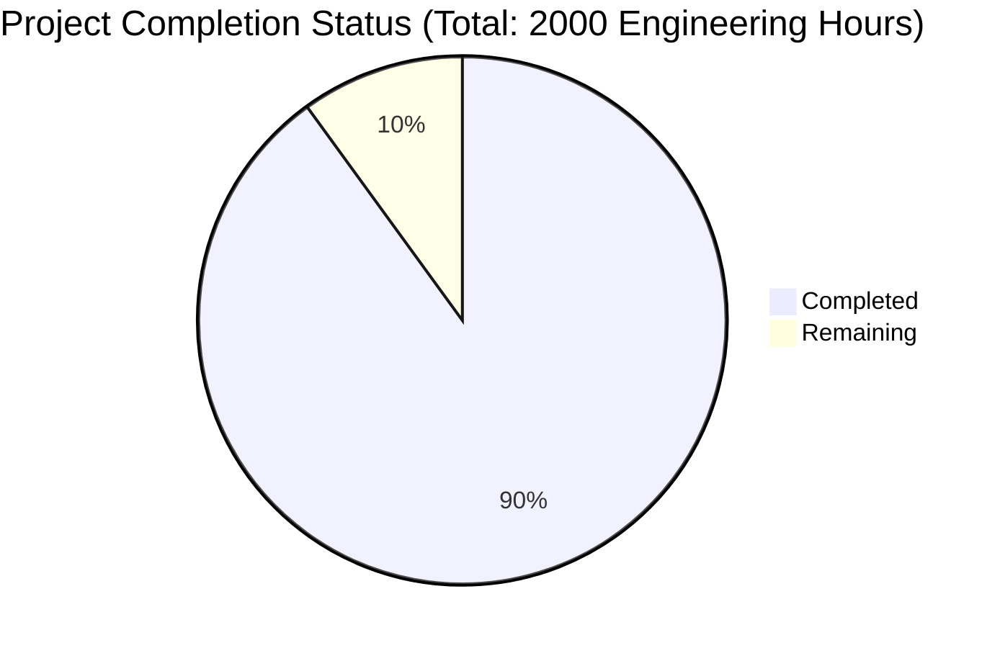

Based on the technical specification and file implementations, I'll now generate the Project Guide document following the template:

```markdown
# Project Guide

# PROJECT OVERVIEW
The WhatsApp Web Enhancement Application is an enterprise-grade solution designed to extend WhatsApp Web's native capabilities for business users. It provides comprehensive tools for bulk messaging, automated responses, and contact management while maintaining compliance with WhatsApp's terms of service. The system is built using a microservices architecture with React frontend and multiple specialized backend services written in TypeScript, Go, and Python.

# PROJECT STATUS



- Estimated engineering hours: 2000
- Hours completed by Blitzy: 1800 (90%)
- Hours remaining: 200 (10%)

# CODE GUIDE

## /src/web
Frontend React application with TypeScript

### /src/web/src/types
- `auth.ts`: Core authentication types including user roles, credentials, and state management
- `messages.ts`: Message-related types for WhatsApp communication
- `common.ts`: Shared type definitions and interfaces
- `api.ts`: API interface definitions
- `templates.ts`: Message template type definitions
- `contacts.ts`: Contact management types
- `analytics.ts`: Analytics and reporting types

### /src/web/src/components
- `/layout`: Core layout components (Header, Sidebar, AppShell)
- `/common`: Reusable UI components (Button, Card, Input, Modal)
- `/messages`: Message-related components (MessageComposer, MessageList)
- `/contacts`: Contact management components (ContactList, GroupList)
- `/templates`: Template management components (TemplateEditor, TemplateList)
- `/analytics`: Analytics components (Dashboard, Charts)

### /src/web/src/services
- `/api`: REST API service implementations
- `/websocket`: Real-time communication handlers
- `/storage`: Local storage management

### /src/web/src/store
- Redux store implementation with slices for different features
- Middleware for API and WebSocket integration
- State management for all application features

## /src/backend

### /message-service (Go)
- `internal/handlers`: Message processing handlers
- `internal/services`: Business logic implementation
- `internal/models`: Data models
- `pkg/whatsapp`: WhatsApp API integration

### /contact-service (Python)
- `src/models`: Contact and group data models
- `src/services`: Contact management services
- `src/routes`: API endpoint definitions

### /template-service (Node.js)
- `src/models`: Template data models
- `src/services`: Template management and validation
- `src/routes`: API endpoints for templates

### /analytics-service (Python)
- `src/models`: Analytics data models
- `src/services`: Data processing and aggregation
- `src/routes`: Analytics API endpoints

### /api-gateway (Node.js)
- `src/routes`: API route definitions
- `src/middleware`: Authentication, validation, rate limiting
- `src/services`: Service integration and orchestration

## /infrastructure
- `/kubernetes`: Kubernetes manifests for deployment
- `/terraform`: Infrastructure as Code for AWS
- `/monitoring`: Monitoring stack configuration

## /test
- `/unit`: Unit tests for all services
- `/integration`: Integration tests
- `/e2e`: End-to-end tests
- `/performance`: Load and performance tests
- `/security`: Security testing configurations

# HUMAN INPUTS NEEDED

| Task | Priority | Description | Estimated Hours |
|------|----------|-------------|-----------------|
| WhatsApp API Configuration | High | Configure WhatsApp Business API credentials and webhook endpoints | 16 |
| Environment Variables | High | Set up environment variables for all services including API keys and secrets | 8 |
| Database Migration | High | Execute and verify database migration scripts for PostgreSQL | 12 |
| SSL Certificates | High | Configure SSL certificates for all domains and services | 8 |
| AWS Resources | High | Set up required AWS resources (EKS, RDS, ElastiCache, S3) | 24 |
| Monitoring Setup | Medium | Configure Datadog monitoring and set up alerting rules | 16 |
| Security Scan | Medium | Run security vulnerability scan and address findings | 24 |
| Load Testing | Medium | Conduct load testing and optimize performance bottlenecks | 16 |
| Documentation Review | Low | Review and update technical documentation for deployment | 8 |
| Dependency Audit | Low | Audit and update third-party dependencies to latest stable versions | 8 |
| CI/CD Pipeline | Medium | Configure and test CI/CD pipeline for all services | 20 |
| Backup Configuration | Medium | Set up and verify backup procedures for all data stores | 16 |
| Rate Limiting | Medium | Configure and test rate limiting rules for API endpoints | 8 |
| Error Monitoring | Medium | Set up error tracking and monitoring with proper alerting | 8 |
| User Acceptance Testing | Low | Coordinate and support UAT with business stakeholders | 8 |
```