# Technical Specifications

# 1. INTRODUCTION

## 1.1 EXECUTIVE SUMMARY

The WhatsApp Web Enhancement Application is a comprehensive web-based solution designed to extend WhatsApp Web's native capabilities for business users. The system addresses critical limitations in bulk messaging, automated responses, and contact management by providing enterprise-grade tools while maintaining compliance with WhatsApp's terms of service. Primary stakeholders include marketing teams, customer service departments, and business administrators who require efficient management of large-scale WhatsApp communications.

This solution delivers measurable business value through automated workflow optimization, reduced manual effort in message management, and improved customer engagement tracking capabilities. The system is positioned as a critical business communications tool that bridges the gap between WhatsApp's consumer-focused web interface and enterprise requirements.

## 1.2 SYSTEM OVERVIEW

### Project Context

| Aspect | Description |
|--------|-------------|
| Market Position | Enterprise-grade WhatsApp management solution for businesses |
| Current Limitations | Limited bulk messaging, no automation, basic contact management |
| Enterprise Integration | Seamless connection with existing CRM, calendar, and storage systems |

### High-Level Description

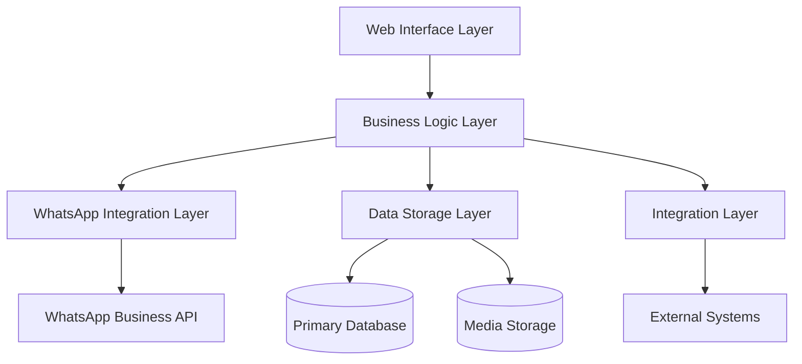
```mermaid
graph TD
    A[Web Interface Layer] --> B[Business Logic Layer]
    B --> C[WhatsApp Integration Layer]
    B --> D[Data Storage Layer]
    B --> E[Integration Layer]
    
    C --> F[WhatsApp Business API]
    D --> G[(Primary Database)]
    D --> H[(Media Storage)]
    E --> I[External Systems]
```

### Success Criteria

| Category | Metrics |
|----------|---------|
| Performance | - Message delivery rate >99% <br> - System response time <2 seconds <br> - Support for 1000+ concurrent users |
| Business Impact | - 50% reduction in message management time <br> - 90% automation of routine responses <br> - 99.9% system uptime |
| User Adoption | - 90% user satisfaction rate <br> - <2 hour average training time <br> - 80% feature utilization within 3 months |

## 1.3 SCOPE

### In-Scope Elements

#### Core Features and Functionalities

| Feature Category | Components |
|-----------------|------------|
| Message Management | - Bulk message composition and delivery <br> - Template management <br> - Message scheduling <br> - Media handling |
| Automation | - Rule-based auto-replies <br> - Scheduled messages <br> - Queue management <br> - Response tracking |
| Contact Management | - Contact import/export <br> - Group management <br> - Segmentation <br> - Activity history |
| Analytics | - Delivery tracking <br> - Engagement metrics <br> - Performance reporting <br> - Custom dashboards |

#### Implementation Boundaries

| Boundary Type | Coverage |
|--------------|----------|
| User Groups | - Business Administrators <br> - Marketing Teams <br> - Customer Service Representatives <br> - System Integrators |
| Geographic Coverage | - Global deployment <br> - Multi-language support <br> - Regional compliance handling |
| Data Domains | - Contact Information <br> - Message Content <br> - Media Assets <br> - Analytics Data |

### Out-of-Scope Elements

- Voice and video call management
- Payment processing integration
- Custom API development for third parties
- End-user mobile applications
- Hardware provisioning
- Direct modifications to WhatsApp core functionality
- Legacy system data migration
- Personal WhatsApp account integration

# 2. SYSTEM ARCHITECTURE

## 2.1 High-Level Architecture

The WhatsApp Web Enhancement Application follows a microservices architecture pattern, organized into distinct functional domains while maintaining high cohesion and loose coupling.

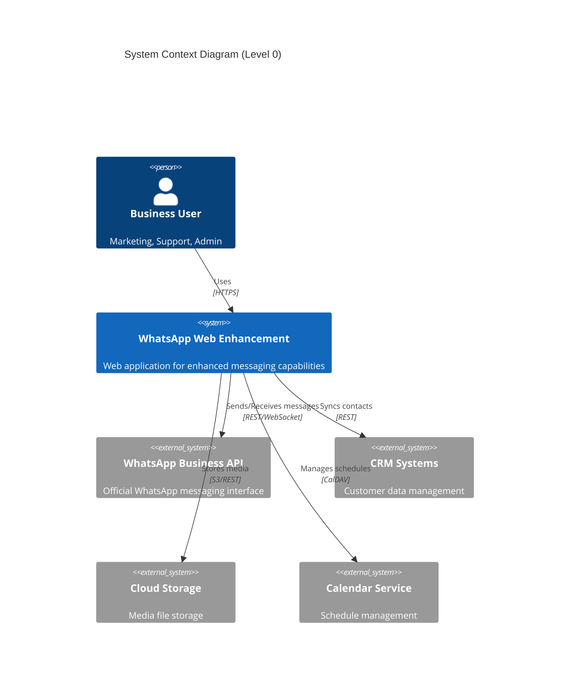
```mermaid
C4Context
    title System Context Diagram (Level 0)
    
    Person(user, "Business User", "Marketing, Support, Admin")
    System(webapp, "WhatsApp Web Enhancement", "Web application for enhanced messaging capabilities")
    System_Ext(whatsapp, "WhatsApp Business API", "Official WhatsApp messaging interface")
    System_Ext(crm, "CRM Systems", "Customer data management")
    System_Ext(storage, "Cloud Storage", "Media file storage")
    System_Ext(calendar, "Calendar Service", "Schedule management")
    
    Rel(user, webapp, "Uses", "HTTPS")
    Rel(webapp, whatsapp, "Sends/Receives messages", "REST/WebSocket")
    Rel(webapp, crm, "Syncs contacts", "REST")
    Rel(webapp, storage, "Stores media", "S3/REST")
    Rel(webapp, calendar, "Manages schedules", "CalDAV")
```

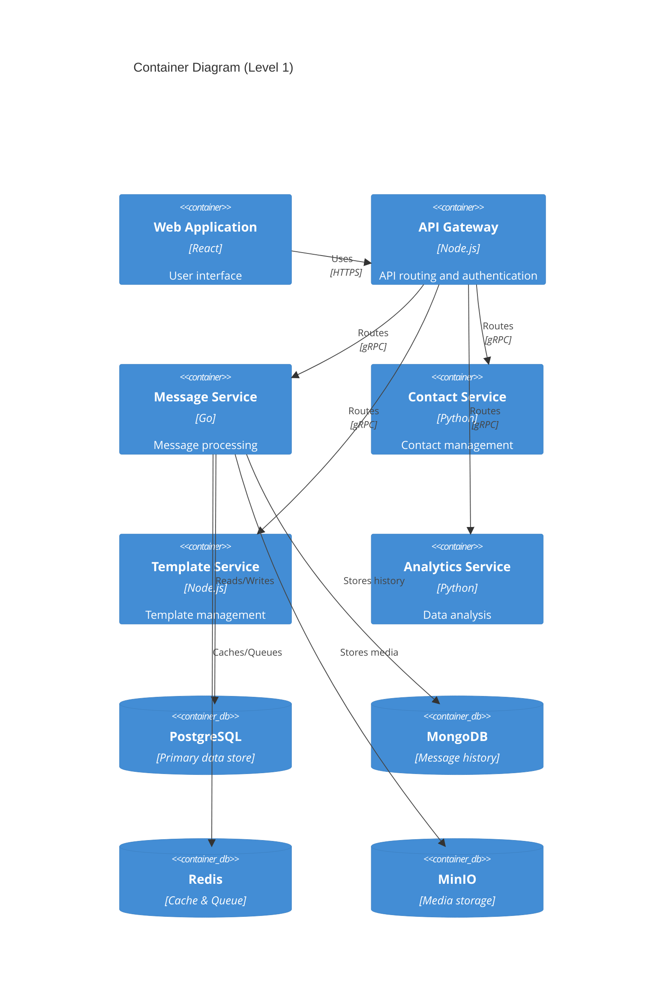
```mermaid
C4Container
    title Container Diagram (Level 1)
    
    Container(web, "Web Application", "React", "User interface")
    Container(api, "API Gateway", "Node.js", "API routing and authentication")
    Container(message, "Message Service", "Go", "Message processing")
    Container(contact, "Contact Service", "Python", "Contact management")
    Container(template, "Template Service", "Node.js", "Template management")
    Container(analytics, "Analytics Service", "Python", "Data analysis")
    
    ContainerDb(postgres, "PostgreSQL", "Primary data store")
    ContainerDb(mongo, "MongoDB", "Message history")
    ContainerDb(redis, "Redis", "Cache & Queue")
    ContainerDb(minio, "MinIO", "Media storage")
    
    Rel(web, api, "Uses", "HTTPS")
    Rel(api, message, "Routes", "gRPC")
    Rel(api, contact, "Routes", "gRPC")
    Rel(api, template, "Routes", "gRPC")
    Rel(api, analytics, "Routes", "gRPC")
    
    Rel(message, postgres, "Reads/Writes")
    Rel(message, mongo, "Stores history")
    Rel(message, redis, "Caches/Queues")
    Rel(message, minio, "Stores media")
```

## 2.2 Component Details

### 2.2.1 Core Components

| Component | Technology Stack | Purpose | Scaling Strategy |
|-----------|-----------------|---------|------------------|
| Web Frontend | React, TypeScript | User interface and interactions | Horizontal with CDN |
| API Gateway | Node.js, Express | Request routing and authentication | Horizontal with load balancer |
| Message Service | Go | Message processing and delivery | Horizontal with sharding |
| Contact Service | Python, FastAPI | Contact management and sync | Horizontal with read replicas |
| Template Service | Node.js | Template management and rendering | Horizontal with caching |
| Analytics Service | Python, NumPy | Data analysis and reporting | Vertical with partitioning |

### 2.2.2 Data Storage Components

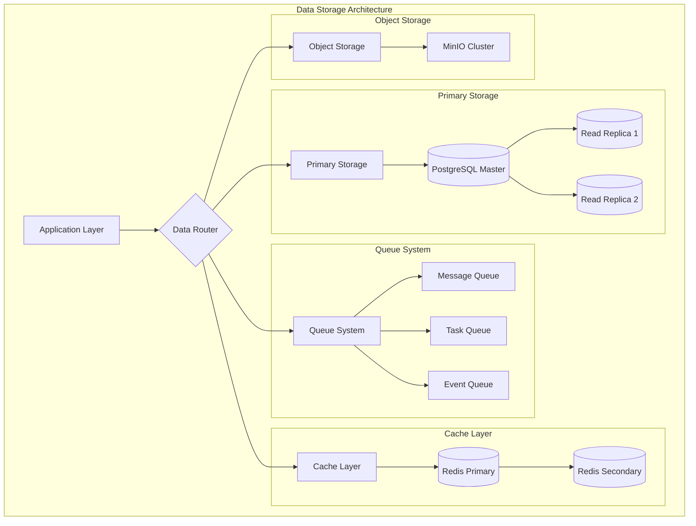
```mermaid
graph TD
    subgraph "Data Storage Architecture"
        A[Application Layer] --> B{Data Router}
        
        B --> C[Primary Storage]
        B --> D[Cache Layer]
        B --> E[Queue System]
        B --> F[Object Storage]
        
        subgraph "Primary Storage"
            C --> G[(PostgreSQL Master)]
            G --> H[(Read Replica 1)]
            G --> I[(Read Replica 2)]
        end
        
        subgraph "Cache Layer"
            D --> J[(Redis Primary)]
            J --> K[(Redis Secondary)]
        end
        
        subgraph "Queue System"
            E --> L[Message Queue]
            E --> M[Task Queue]
            E --> N[Event Queue]
        end
        
        subgraph "Object Storage"
            F --> O[MinIO Cluster]
        end
    end
```

## 2.3 Technical Decisions

### 2.3.1 Architecture Patterns

| Pattern | Implementation | Justification |
|---------|---------------|---------------|
| Microservices | Domain-driven services | Scalability and maintainability |
| Event-Driven | Redis pub/sub | Real-time updates and loose coupling |
| CQRS | Separate read/write paths | Performance optimization |
| Circuit Breaker | Resilience4j | Fault tolerance |
| API Gateway | Node.js/Express | Security and routing |

### 2.3.2 Communication Patterns

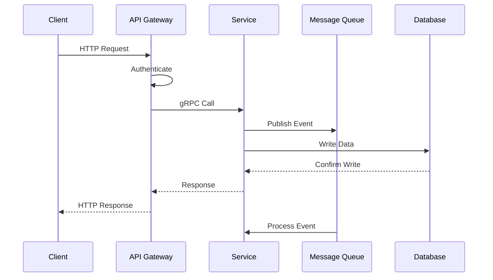
```mermaid
sequenceDiagram
    participant C as Client
    participant G as API Gateway
    participant S as Service
    participant Q as Message Queue
    participant D as Database
    
    C->>G: HTTP Request
    G->>G: Authenticate
    G->>S: gRPC Call
    S->>Q: Publish Event
    S->>D: Write Data
    D-->>S: Confirm Write
    S-->>G: Response
    G-->>C: HTTP Response
    Q->>S: Process Event
```

## 2.4 Cross-Cutting Concerns

### 2.4.1 System Monitoring

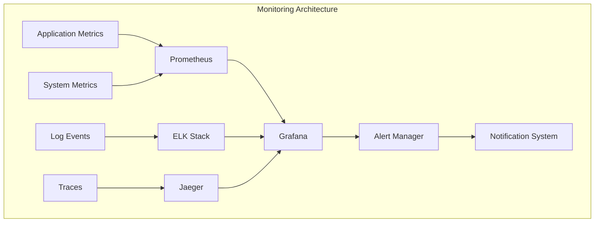
```mermaid
graph TD
    subgraph "Monitoring Architecture"
        A[Application Metrics] --> B[Prometheus]
        C[System Metrics] --> B
        D[Log Events] --> E[ELK Stack]
        F[Traces] --> G[Jaeger]
        
        B --> H[Grafana]
        E --> H
        G --> H
        
        H --> I[Alert Manager]
        I --> J[Notification System]
    end
```

### 2.4.2 Security Architecture

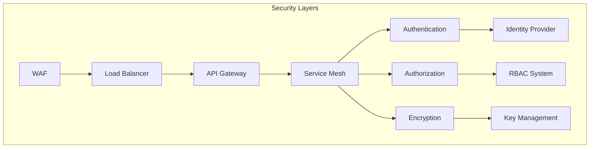
```mermaid
graph TD
    subgraph "Security Layers"
        A[WAF] --> B[Load Balancer]
        B --> C[API Gateway]
        C --> D[Service Mesh]
        
        D --> E[Authentication]
        D --> F[Authorization]
        D --> G[Encryption]
        
        E --> H[Identity Provider]
        F --> I[RBAC System]
        G --> J[Key Management]
    end
```

### 2.4.3 Deployment Architecture

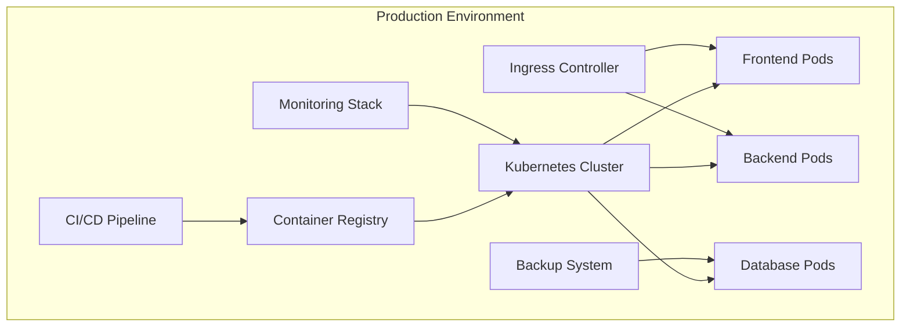
```mermaid
graph TD
    subgraph "Production Environment"
        A[CI/CD Pipeline] --> B[Container Registry]
        B --> C[Kubernetes Cluster]
        
        C --> D[Frontend Pods]
        C --> E[Backend Pods]
        C --> F[Database Pods]
        
        G[Ingress Controller] --> D
        G --> E
        
        H[Monitoring Stack] --> C
        I[Backup System] --> F
    end
```

## 2.5 Infrastructure Requirements

| Component | Specification | Redundancy | Scaling Limits |
|-----------|--------------|------------|----------------|
| Load Balancer | AWS ALB/NLB | Multi-AZ | 100K concurrent |
| Application Servers | t3.large | N+1 | 1000 req/sec/node |
| Database Servers | r5.xlarge | Active-Passive | 10K transactions/sec |
| Cache Servers | r6g.large | Multi-AZ | 100K ops/sec |
| Object Storage | Standard | 3x replication | 1PB storage |

# 3. SYSTEM COMPONENTS ARCHITECTURE

## 3.1 USER INTERFACE DESIGN

### 3.1.1 Design System Specifications

| Component | Specification | Implementation Details |
|-----------|--------------|----------------------|
| Typography | Roboto Family | Headings: 24-48px, Body: 16px, Labels: 14px |
| Color Palette | Material Design 3.0 | Primary: #1976D2, Secondary: #424242, Error: #D32F2F |
| Spacing System | 8px Base Grid | Margins: 16-32px, Padding: 8-24px |
| Breakpoints | Mobile First | xs: 0px, sm: 600px, md: 960px, lg: 1280px, xl: 1920px |
| Elevation | 5 Levels | Shadows: 2px-24px with varying opacity |
| Animations | Material Motion | Duration: 200-300ms, Easing: cubic-bezier(0.4, 0, 0.2, 1) |

### 3.1.2 Component Library

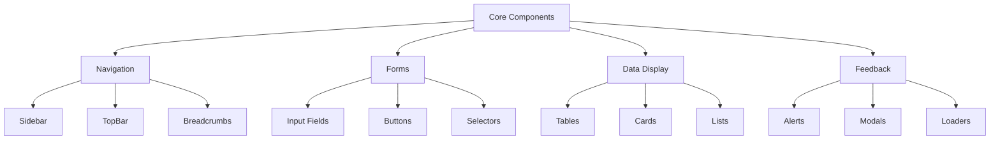
```mermaid
graph TD
    A[Core Components] --> B[Navigation]
    A --> C[Forms]
    A --> D[Data Display]
    A --> E[Feedback]
    
    B --> B1[Sidebar]
    B --> B2[TopBar]
    B --> B3[Breadcrumbs]
    
    C --> C1[Input Fields]
    C --> C2[Buttons]
    C --> C3[Selectors]
    
    D --> D1[Tables]
    D --> D2[Cards]
    D --> D3[Lists]
    
    E --> E1[Alerts]
    E --> E2[Modals]
    E --> E3[Loaders]
```

### 3.1.3 Critical User Flows

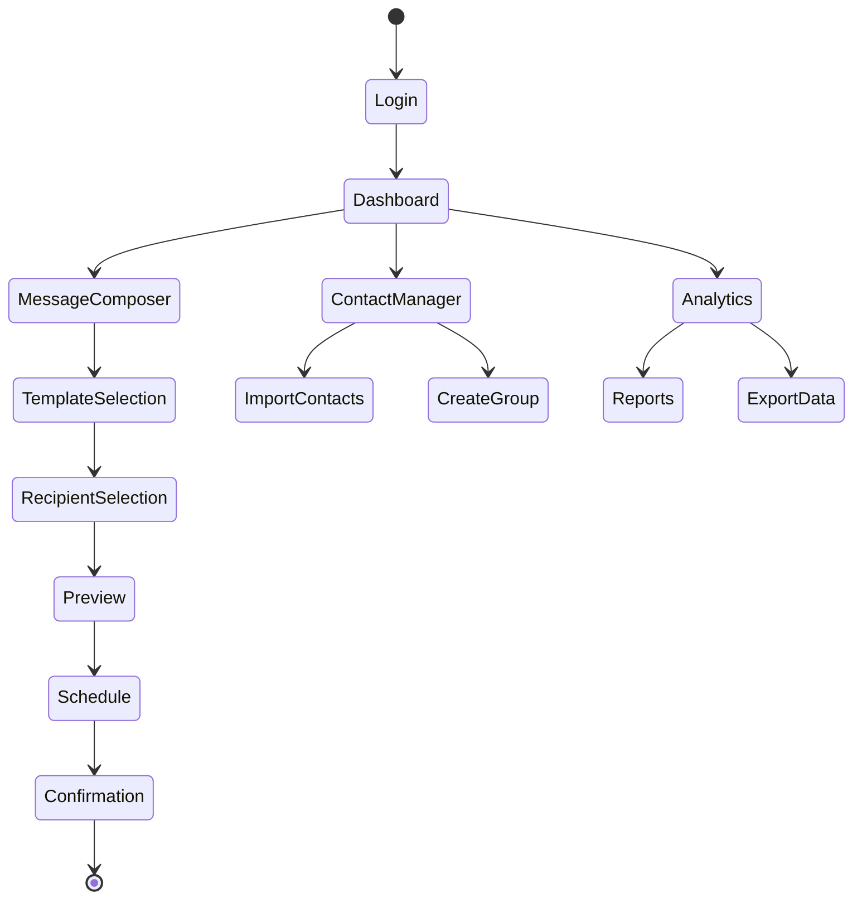
```mermaid
stateDiagram-v2
    [*] --> Login
    Login --> Dashboard
    Dashboard --> MessageComposer
    MessageComposer --> TemplateSelection
    TemplateSelection --> RecipientSelection
    RecipientSelection --> Preview
    Preview --> Schedule
    Schedule --> Confirmation
    Confirmation --> [*]
    
    Dashboard --> ContactManager
    ContactManager --> ImportContacts
    ContactManager --> CreateGroup
    
    Dashboard --> Analytics
    Analytics --> Reports
    Analytics --> ExportData
```

### 3.1.4 Accessibility Requirements

| Category | Requirement | Implementation |
|----------|-------------|----------------|
| Keyboard Navigation | Full Support | Tab order, Focus indicators, Shortcuts |
| Screen Readers | ARIA Labels | Role attributes, Live regions, Descriptions |
| Color Contrast | WCAG 2.1 AA | Minimum 4.5:1 for text, 3:1 for large text |
| Text Scaling | 200% Support | Fluid typography, Responsive layouts |
| Input Methods | Multiple | Touch, Mouse, Keyboard, Voice |
| Error Handling | Clear Feedback | Visual and auditory cues, Error recovery |

## 3.2 DATABASE DESIGN

### 3.2.1 Schema Design

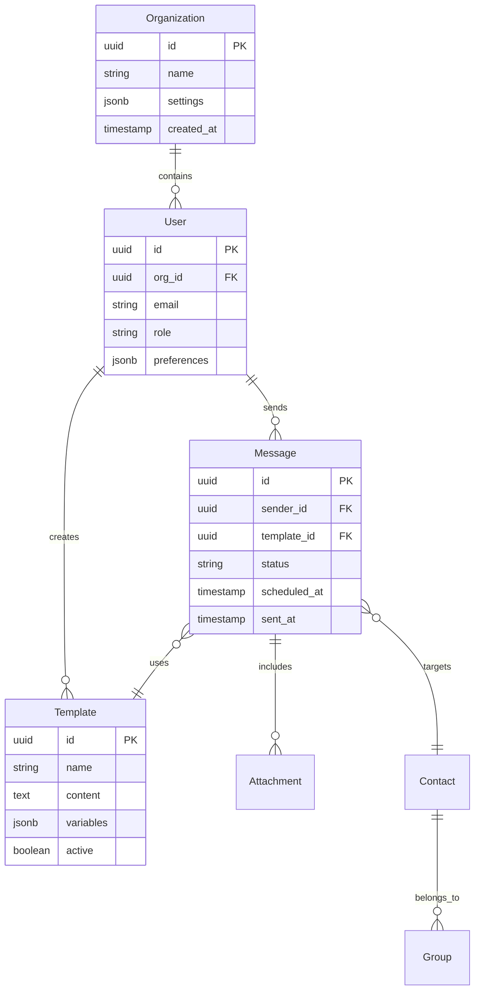
```mermaid
erDiagram
    Organization ||--o{ User : contains
    User ||--o{ Message : sends
    User ||--o{ Template : creates
    Message ||--o{ Attachment : includes
    Message }o--|| Template : uses
    Contact ||--o{ Group : belongs_to
    Message }o--|| Contact : targets
    
    Organization {
        uuid id PK
        string name
        jsonb settings
        timestamp created_at
    }
    
    User {
        uuid id PK
        uuid org_id FK
        string email
        string role
        jsonb preferences
    }
    
    Message {
        uuid id PK
        uuid sender_id FK
        uuid template_id FK
        string status
        timestamp scheduled_at
        timestamp sent_at
    }
    
    Template {
        uuid id PK
        string name
        text content
        jsonb variables
        boolean active
    }
```

### 3.2.2 Data Management Strategy

| Aspect | Strategy | Implementation Details |
|--------|----------|----------------------|
| Partitioning | Time-based | Monthly message partitions, Yearly archive tables |
| Indexing | Selective | B-tree for IDs, GiST for text search, Hash for exact match |
| Replication | Multi-AZ | Synchronous primary-secondary with automated failover |
| Backup | Incremental | Hourly WAL shipping, Daily full backups, 30-day retention |
| Archival | Policy-based | 90-day active retention, 1-year warm storage, 7-year cold storage |
| Encryption | AES-256 | TDE for at-rest, TLS 1.3 for in-transit |

## 3.3 API DESIGN

### 3.3.1 API Architecture

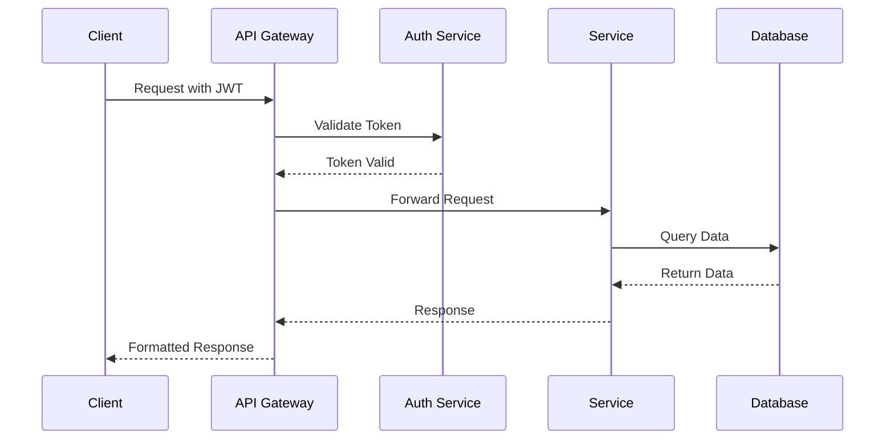
```mermaid
sequenceDiagram
    participant C as Client
    participant G as API Gateway
    participant A as Auth Service
    participant S as Service
    participant D as Database
    
    C->>G: Request with JWT
    G->>A: Validate Token
    A-->>G: Token Valid
    G->>S: Forward Request
    S->>D: Query Data
    D-->>S: Return Data
    S-->>G: Response
    G-->>C: Formatted Response
```

### 3.3.2 Endpoint Specifications

| Endpoint | Method | Request Format | Response Format | Rate Limit |
|----------|--------|----------------|-----------------|------------|
| /api/v1/messages | POST | JSON | JSON | 100/min |
| /api/v1/contacts | GET | Query Params | JSON | 1000/min |
| /api/v1/templates | PUT | JSON | JSON | 50/min |
| /api/v1/analytics | GET | Query Params | JSON | 500/min |
| /api/v1/media | POST | Multipart | JSON | 100/min |

### 3.3.3 Authentication Flow

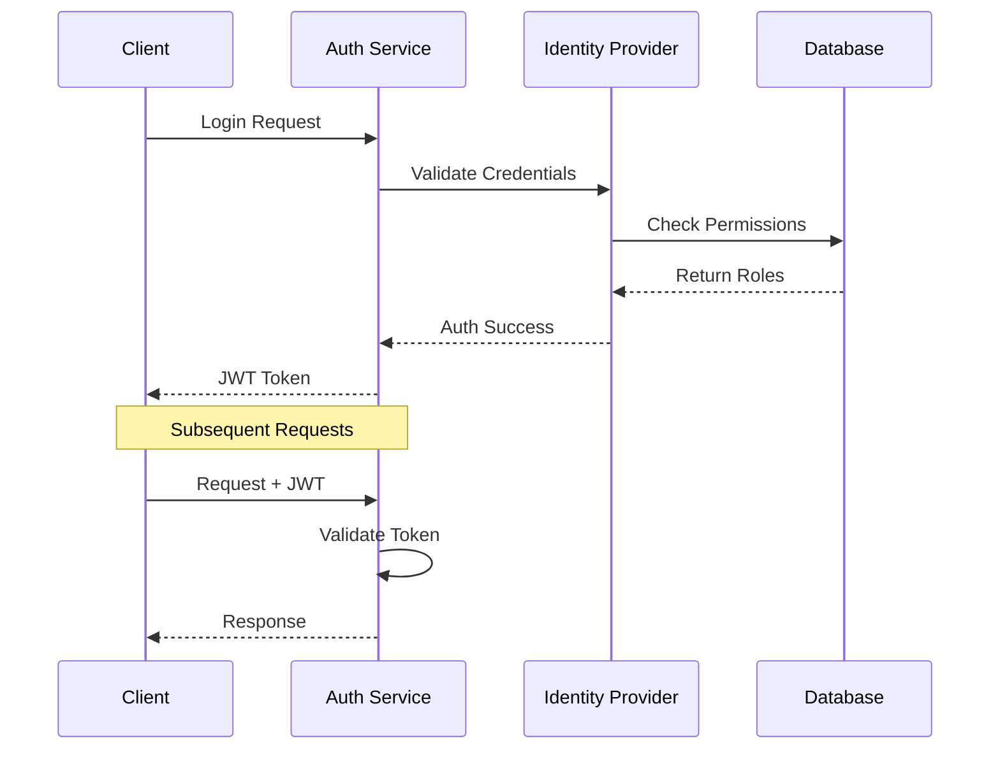
```mermaid
sequenceDiagram
    participant C as Client
    participant A as Auth Service
    participant I as Identity Provider
    participant D as Database
    
    C->>A: Login Request
    A->>I: Validate Credentials
    I->>D: Check Permissions
    D-->>I: Return Roles
    I-->>A: Auth Success
    A-->>C: JWT Token
    
    Note over C,A: Subsequent Requests
    C->>A: Request + JWT
    A->>A: Validate Token
    A-->>C: Response
```

### 3.3.4 Integration Patterns

| Pattern | Implementation | Purpose |
|---------|---------------|---------|
| Circuit Breaker | Resilience4j | Fault tolerance |
| Rate Limiting | Token Bucket | Traffic control |
| Caching | Redis | Performance |
| Service Discovery | Consul | Dynamic routing |
| Load Balancing | Round Robin | Distribution |
| Retry Policy | Exponential Backoff | Reliability |

# 4. TECHNOLOGY STACK

## 4.1 PROGRAMMING LANGUAGES

| Layer | Language | Version | Justification |
|-------|----------|---------|---------------|
| Frontend | TypeScript | 5.0+ | Type safety, enhanced developer experience, better maintainability |
| API Gateway | Node.js | 20 LTS | High performance event-driven architecture, extensive package ecosystem |
| Message Service | Go | 1.21+ | High concurrency, efficient resource usage, fast message processing |
| Contact Service | Python | 3.11+ | Rich data processing libraries, ML capabilities for future features |
| Template Service | Node.js | 20 LTS | Efficient template rendering, JavaScript ecosystem compatibility |
| Analytics Service | Python | 3.11+ | Strong analytics libraries, data processing capabilities |

## 4.2 FRAMEWORKS & LIBRARIES

### Frontend Framework Stack

| Component | Technology | Version | Purpose |
|-----------|------------|---------|----------|
| Core Framework | React | 18.2+ | Component-based architecture, virtual DOM efficiency |
| State Management | Redux Toolkit | 1.9+ | Predictable state management, RTK Query for API integration |
| UI Components | Material UI | 5.14+ | Consistent design system, accessibility compliance |
| Form Handling | React Hook Form | 7.45+ | Performance-focused form validation and handling |
| Data Visualization | D3.js | 7.8+ | Custom analytics visualizations, real-time updates |

### Backend Framework Stack

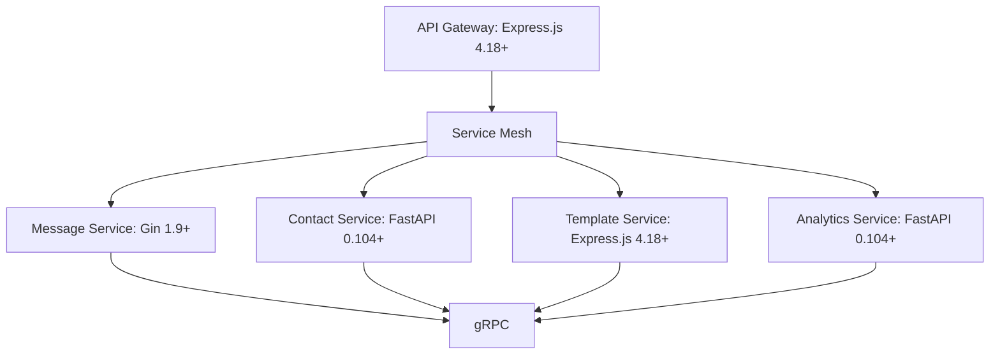
```mermaid
graph TD
    A[API Gateway: Express.js 4.18+] --> B[Service Mesh]
    B --> C[Message Service: Gin 1.9+]
    B --> D[Contact Service: FastAPI 0.104+]
    B --> E[Template Service: Express.js 4.18+]
    B --> F[Analytics Service: FastAPI 0.104+]
    
    C --> G[gRPC]
    D --> G
    E --> G
    F --> G
```

## 4.3 DATABASES & STORAGE

### Primary Data Stores

| Store Type | Technology | Version | Usage |
|------------|------------|---------|--------|
| RDBMS | PostgreSQL | 15+ | Transactional data, user management |
| Document Store | MongoDB | 7.0+ | Message history, analytics data |
| Cache | Redis | 7.2+ | Session management, message queue |
| Object Storage | MinIO | RELEASE.2023-10-07 | Media file storage |

### Data Flow Architecture

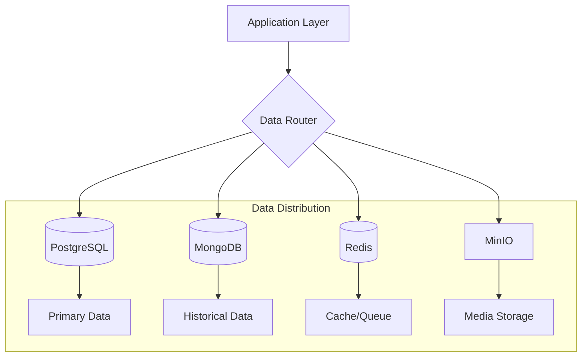
```mermaid
graph TD
    A[Application Layer] --> B{Data Router}
    B --> C[(PostgreSQL)]
    B --> D[(MongoDB)]
    B --> E[(Redis)]
    B --> F[MinIO]
    
    subgraph "Data Distribution"
        C --> G[Primary Data]
        D --> H[Historical Data]
        E --> I[Cache/Queue]
        F --> J[Media Storage]
    end
```

## 4.4 THIRD-PARTY SERVICES

| Service Category | Provider | Purpose | Integration Method |
|-----------------|----------|---------|-------------------|
| Message API | WhatsApp Business API | Core messaging | REST/WebSocket |
| Authentication | Auth0 | User authentication | OAuth 2.0 |
| Monitoring | Datadog | System monitoring | Agent-based |
| CDN | Cloudflare | Content delivery | DNS/Proxy |
| Email | SendGrid | Notifications | SMTP/API |

## 4.5 DEVELOPMENT & DEPLOYMENT

### Development Environment

| Tool | Version | Purpose |
|------|---------|---------|
| Docker | 24+ | Container runtime |
| Kubernetes | 1.28+ | Container orchestration |
| Terraform | 1.6+ | Infrastructure as code |
| GitHub Actions | N/A | CI/CD pipeline |

### Deployment Pipeline

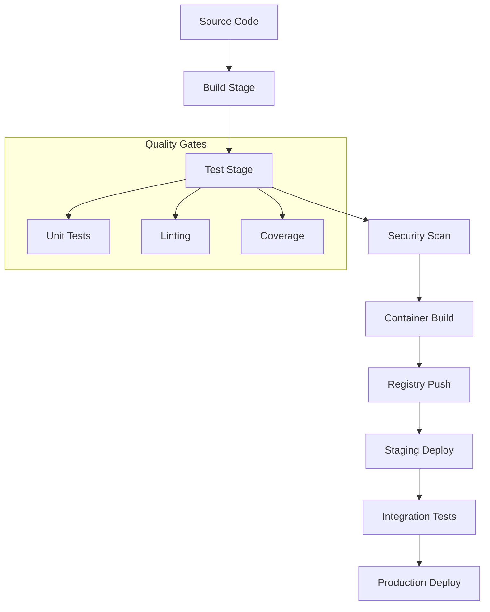
```mermaid
graph TD
    A[Source Code] --> B[Build Stage]
    B --> C[Test Stage]
    C --> D[Security Scan]
    D --> E[Container Build]
    E --> F[Registry Push]
    F --> G[Staging Deploy]
    G --> H[Integration Tests]
    H --> I[Production Deploy]
    
    subgraph "Quality Gates"
        C --> J[Unit Tests]
        C --> K[Linting]
        C --> L[Coverage]
    end
```

### Infrastructure Architecture

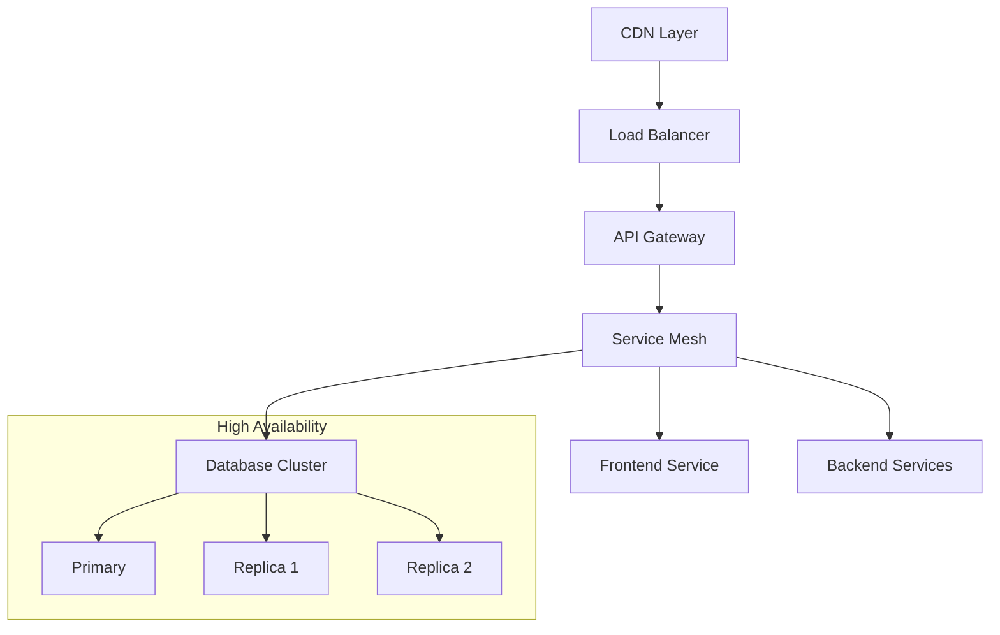
```mermaid
graph TD
    A[CDN Layer] --> B[Load Balancer]
    B --> C[API Gateway]
    C --> D[Service Mesh]
    
    D --> E[Frontend Service]
    D --> F[Backend Services]
    D --> G[Database Cluster]
    
    subgraph "High Availability"
        G --> H[Primary]
        G --> I[Replica 1]
        G --> J[Replica 2]
    end
```

# 5. SYSTEM DESIGN

## 5.1 USER INTERFACE DESIGN

### 5.1.1 Layout Structure

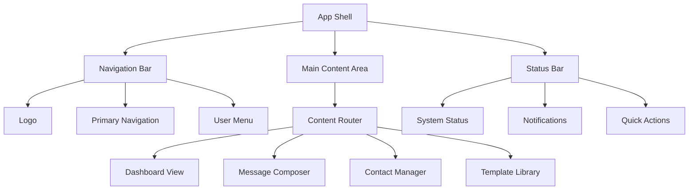
```mermaid
graph TD
    A[App Shell] --> B[Navigation Bar]
    A --> C[Main Content Area]
    A --> D[Status Bar]
    
    B --> E[Logo]
    B --> F[Primary Navigation]
    B --> G[User Menu]
    
    C --> H[Content Router]
    H --> I[Dashboard View]
    H --> J[Message Composer]
    H --> K[Contact Manager]
    H --> L[Template Library]
    
    D --> M[System Status]
    D --> N[Notifications]
    D --> O[Quick Actions]
```

### 5.1.2 Core Components

| Component | Description | Key Features |
|-----------|-------------|--------------|
| Message Composer | Rich text editor with template support | - Template selection<br>- Variable insertion<br>- Media upload<br>- Preview mode |
| Contact Manager | Grid/list view of contacts with filters | - Bulk actions<br>- Group management<br>- Search/filter<br>- Import/export |
| Template Library | Card-based template gallery | - Categories<br>- Version history<br>- Usage analytics<br>- Quick edit |
| Analytics Dashboard | Data visualization panels | - Real-time metrics<br>- Custom reports<br>- Export options<br>- Filters |

### 5.1.3 Responsive Breakpoints

| Breakpoint | Width Range | Layout Adjustments |
|------------|-------------|-------------------|
| Desktop | ≥1280px | Full sidebar, 3-column grid |
| Tablet | 768px-1279px | Collapsible sidebar, 2-column grid |
| Mobile | <768px | Bottom navigation, single column |

## 5.2 DATABASE DESIGN

### 5.2.1 Schema Architecture

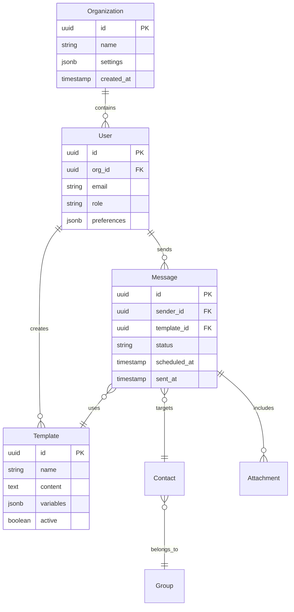
```mermaid
erDiagram
    Organization ||--o{ User : contains
    User ||--o{ Message : sends
    User ||--o{ Template : creates
    Message }o--|| Template : uses
    Message }o--|| Contact : targets
    Contact }o--|| Group : belongs_to
    Message ||--o{ Attachment : includes
    
    Organization {
        uuid id PK
        string name
        jsonb settings
        timestamp created_at
    }
    
    User {
        uuid id PK
        uuid org_id FK
        string email
        string role
        jsonb preferences
    }
    
    Message {
        uuid id PK
        uuid sender_id FK
        uuid template_id FK
        string status
        timestamp scheduled_at
        timestamp sent_at
    }
    
    Template {
        uuid id PK
        string name
        text content
        jsonb variables
        boolean active
    }
```

### 5.2.2 Storage Strategy

| Data Type | Storage Solution | Partitioning Strategy |
|-----------|-----------------|---------------------|
| Transactional | PostgreSQL | Time-based partitioning |
| Message History | MongoDB | Sharding by organization |
| Media Files | MinIO | Content-based distribution |
| Cache/Queue | Redis | Memory-based segmentation |

### 5.2.3 Indexing Strategy

| Table | Index Type | Fields | Purpose |
|-------|------------|--------|---------|
| messages | B-tree | (org_id, created_at) | Time-based queries |
| contacts | Hash | phone_number | Exact lookups |
| templates | GiST | content | Full-text search |
| attachments | B-tree | (message_id, type) | Related content |

## 5.3 API DESIGN

### 5.3.1 REST Endpoints

| Endpoint | Method | Purpose | Request Format |
|----------|--------|---------|----------------|
| /api/v1/messages | POST | Send message | JSON payload |
| /api/v1/contacts | GET | List contacts | Query parameters |
| /api/v1/templates | PUT | Update template | JSON payload |
| /api/v1/analytics | GET | Fetch metrics | Query parameters |

### 5.3.2 WebSocket Events

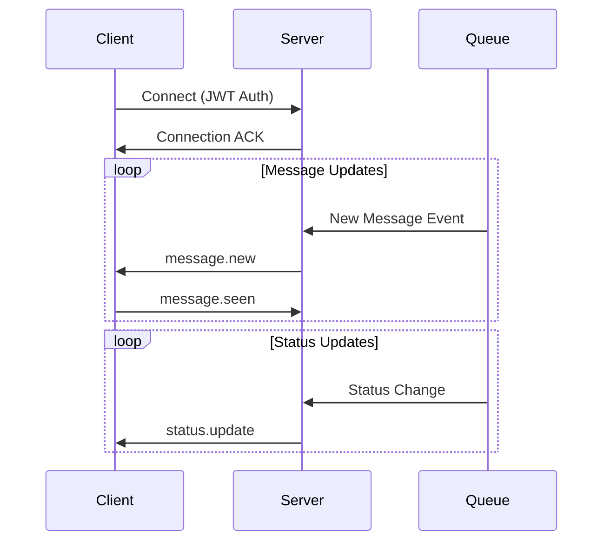
```mermaid
sequenceDiagram
    participant Client
    participant Server
    participant Queue
    
    Client->>Server: Connect (JWT Auth)
    Server->>Client: Connection ACK
    
    loop Message Updates
        Queue->>Server: New Message Event
        Server->>Client: message.new
        Client->>Server: message.seen
    end
    
    loop Status Updates
        Queue->>Server: Status Change
        Server->>Client: status.update
    end
```

### 5.3.3 Integration Interfaces

| Service | Protocol | Authentication | Rate Limit |
|---------|----------|----------------|------------|
| WhatsApp API | REST/WebSocket | Bearer Token | 1000/min |
| CRM Systems | REST | OAuth 2.0 | 100/min |
| Storage Services | S3 | IAM | 500/min |
| Analytics | GraphQL | API Key | 50/min |

### 5.3.4 Error Handling

```mermaid
flowchart TD
    A[API Request] --> B{Validate}
    B -->|Invalid| C[Error Response]
    B -->|Valid| D[Process Request]
    
    D --> E{Check Result}
    E -->|Success| F[Success Response]
    E -->|Error| G[Error Handler]
    
    G --> H{Error Type}
    H -->|Business| I[400 Response]
    H -->|Auth| J[401/403 Response]
    H -->|System| K[500 Response]
    
    I --> L[Error Logger]
    J --> L
    K --> L
```

# 6. USER INTERFACE DESIGN

## 6.1 Design System

| Element | Specification | Implementation |
|---------|--------------|----------------|
| Typography | Roboto Family | Headings: 24-48px, Body: 16px |
| Colors | Material Design | Primary: #1976D2, Secondary: #424242 |
| Spacing | 8px Grid | Margins: 16-32px, Padding: 8-24px |
| Breakpoints | Mobile-First | xs: 0px, sm: 600px, md: 960px |
| Elevation | 5 Levels | Box shadows with varying opacity |

## 6.2 Core Layouts

### 6.2.1 Dashboard Layout

```
+----------------------------------------------------------+
|  [#] WhatsApp Web Enhancement    [@] Admin    [=] Settings |
+------------------+-------------------------------------------+
|                  |                                         |
| [#] Dashboard    |  Quick Actions                         |
| [+] Compose      |  +------------+  +------------+        |
| [@] Contacts     |  | New Message|  | Templates  |        |
| [*] Templates    |  +------------+  +------------+        |
| [$] Analytics    |                                        |
|                  |  Recent Activity                       |
| Groups           |  +----------------------------------+  |
| +-- Marketing    |  | [!] 23 messages pending delivery |  |
| +-- Support      |  | [i] 5 new contact imports       |  |
| +-- Sales        |  | [*] Template "Welcome" updated  |  |
|                  |  +----------------------------------+  |
+------------------+----------------------------------------+
```

### 6.2.2 Message Composer

```
+----------------------------------------------------------+
| [<] Back    Compose Message                    [?] Help   |
+----------------------------------------------------------+
| Template: [...........................] [v]               |
|                                                          |
| Recipients:                                              |
| +--------------------------------------------------+    |
| | [x] Marketing Group (245)                         |    |
| | [x] John Doe (+1234567890)                       |    |
| | [+] Add Recipients                               |    |
| +--------------------------------------------------+    |
|                                                          |
| Message:                                                 |
| +--------------------------------------------------+    |
| | Hello {first_name},                               |    |
| |                                                   |    |
| | {message_body}                                    |    |
| |                                                   |    |
| | Best regards,                                     |    |
| | {company_name}                                    |    |
| +--------------------------------------------------+    |
|                                                          |
| Attachments: [^ Upload] (Max 16MB)                      |
|                                                          |
| Schedule: ( ) Send Now  ( ) Schedule for Later          |
| Date: [.......] Time: [.......] Timezone: [v]           |
|                                                          |
| [Preview Message]        [Schedule]        [Send Now]    |
+----------------------------------------------------------+
```

### 6.2.3 Contact Manager

```
+----------------------------------------------------------+
| Contacts                          [^ Import] [+ Add New]   |
+----------------------------------------------------------+
| Search: [.....................] [v] Filter                 |
|                                                           |
| [ ] Select All                                            |
| +-------------------------------------------------------+|
| |[x] Name          Phone         Group      Last Contact ||
| |------------------------------------------------------|
| |[ ] John Doe      +1234567890   Marketing  2023-10-01  ||
| |[ ] Jane Smith    +0987654321   Support    2023-10-02  ||
| |[ ] Bob Wilson    +1122334455   Sales      2023-10-03  ||
| +-------------------------------------------------------+|
|                                                           |
| With Selected: [v]                                        |
| [Delete] [Export] [Add to Group] [Send Message]           |
|                                                           |
| Showing 1-3 of 1,234 contacts    [< 1 2 3 ... 50 >]      |
+----------------------------------------------------------+
```

### 6.2.4 Analytics Dashboard

```
+----------------------------------------------------------+
| Analytics Overview                     [Export] [? Help]    |
+----------------------------------------------------------+
| Date Range: [v Last 30 Days]    Refresh: [Auto Update]     |
|                                                            |
| Message Statistics                                         |
| +------------------------+  +-------------------------+     |
| | Sent: 1,234           |  | Delivery Rate: [====  ] |     |
| | Delivered: 1,200      |  | 97.2%                  |     |
| | Failed: 34            |  |                        |     |
| +------------------------+  +-------------------------+     |
|                                                            |
| Template Performance                                       |
| +-------------------------------------------------------+|
| | Template      | Sent  | Opened | Replied | Conversion ||
| |------------------------------------------------------|
| | Welcome       | 500   | 450    | 125     | 27.7%     ||
| | Promotion     | 300   | 275    | 89      | 32.4%     ||
| | Support       | 434   | 400    | 145     | 36.2%     ||
| +-------------------------------------------------------+|
+----------------------------------------------------------+
```

## 6.3 Component Legend

### Navigation Icons
- [#] Dashboard/Menu
- [@] User/Profile
- [=] Settings
- [<] Back
- [>] Forward
- [?] Help
- [!] Alert/Warning
- [i] Information
- [*] Important/Favorite
- [$] Analytics/Financial

### Input Elements
- [...] Text input field
- [ ] Checkbox
- ( ) Radio button
- [v] Dropdown menu
- [^ Upload] File upload
- [====] Progress bar
- [Button] Action button

### Layout Elements
- +--+ Box borders
- |  | Vertical separators
- +-- Tree view hierarchy
- --- Table separators

## 6.4 Responsive Behavior

| Breakpoint | Layout Adjustments |
|------------|-------------------|
| Desktop (≥1280px) | Full sidebar, 3-column grid |
| Tablet (768-1279px) | Collapsible sidebar, 2-column |
| Mobile (<768px) | Bottom navigation, single column |

## 6.5 Interaction States

| Element | States | Visual Indicator |
|---------|--------|-----------------|
| Buttons | Hover, Active, Disabled | Color change, opacity |
| Links | Hover, Visited, Active | Underline, color |
| Inputs | Focus, Error, Success | Border color, icon |
| Cards | Hover, Selected | Elevation, border |

# 7. SECURITY CONSIDERATIONS

## 7.1 AUTHENTICATION AND AUTHORIZATION

### 7.1.1 Authentication Flow

```mermaid
sequenceDiagram
    participant U as User
    participant F as Frontend
    participant A as Auth Service
    participant I as Identity Provider
    participant S as System Services
    
    U->>F: Access Request
    F->>A: Forward Credentials
    A->>I: Validate (OAuth 2.0)
    I-->>A: Token Response
    A-->>F: JWT + Refresh Token
    F->>S: Request + JWT
    S->>A: Validate Token
    A-->>S: Token Valid
    S-->>F: Response
    F-->>U: Access Granted
```

### 7.1.2 Authorization Matrix

| Role | Message Management | Contact Management | Template Management | Analytics | System Config |
|------|-------------------|-------------------|-------------------|-----------|---------------|
| Admin | Full Access | Full Access | Full Access | Full Access | Full Access |
| Manager | Create/Edit/Delete | Create/Edit/Delete | Create/Edit | View/Export | View Only |
| Agent | Create/Edit | View Only | Use Only | View Own | None |
| Viewer | View Only | View Only | View Only | View Own | None |

## 7.2 DATA SECURITY

### 7.2.1 Encryption Standards

| Data State | Method | Key Length | Rotation Period |
|------------|--------|------------|----------------|
| At Rest | AES-256-GCM | 256-bit | 90 days |
| In Transit | TLS 1.3 | 256-bit | Session-based |
| Database | TDE | 256-bit | 180 days |
| Backups | AES-256-CBC | 256-bit | 90 days |

### 7.2.2 Data Protection Architecture

```mermaid
graph TD
    A[Client Request] --> B{WAF}
    B --> C[Load Balancer]
    C --> D[API Gateway]
    
    subgraph "Security Layers"
        D --> E[TLS Termination]
        E --> F[Authentication]
        F --> G[Authorization]
        G --> H[Data Processing]
    end
    
    H --> I{Encryption Router}
    I --> J[(Encrypted DB)]
    I --> K[(Encrypted Files)]
    I --> L[(Encrypted Cache)]
```

## 7.3 SECURITY PROTOCOLS

### 7.3.1 Access Control Measures

| Control Type | Implementation | Monitoring |
|-------------|----------------|------------|
| Network | IP Whitelisting, WAF Rules | Real-time threat detection |
| Application | RBAC, JWT Validation | Access log analysis |
| Database | Row-level security, Connection encryption | Query monitoring |
| Infrastructure | VPC isolation, Security groups | Network flow logs |

### 7.3.2 Security Monitoring

```mermaid
graph TD
    subgraph "Security Monitoring System"
        A[Security Events] --> B{SIEM}
        B --> C[Threat Detection]
        B --> D[Compliance Monitoring]
        B --> E[Access Analysis]
        
        C --> F[Alert System]
        D --> F
        E --> F
        
        F --> G[Security Team]
        F --> H[Automated Response]
    end
```

### 7.3.3 Compliance Requirements

| Requirement | Implementation | Validation |
|-------------|----------------|------------|
| GDPR | Data encryption, Access controls, Retention policies | Quarterly audit |
| CCPA | Data inventory, Opt-out mechanism, Disclosure tracking | Monthly review |
| SOC 2 | Security controls, Monitoring, Incident response | Annual certification |
| PCI DSS | Cardholder data protection, Network security | Quarterly scan |

### 7.3.4 Security Response Protocol

```mermaid
sequenceDiagram
    participant D as Detection System
    participant S as Security Team
    participant I as Incident Response
    participant R as Recovery Team
    
    D->>S: Security Alert
    S->>I: Assess Threat
    I->>I: Containment
    I->>R: Recovery Required
    R->>R: Execute Recovery
    R-->>I: Recovery Complete
    I-->>S: Incident Report
    S->>S: Update Procedures
```

### 7.3.5 Security Testing Schedule

| Test Type | Frequency | Scope | Responsible Team |
|-----------|-----------|-------|------------------|
| Penetration Testing | Quarterly | External/Internal infrastructure | Security Team |
| Vulnerability Scan | Weekly | All systems and applications | DevOps |
| Security Audit | Semi-annual | Compliance and controls | Compliance Team |
| Code Security Review | Per release | Application code | Development Team |

# 8. INFRASTRUCTURE

## 8.1 DEPLOYMENT ENVIRONMENT

The WhatsApp Web Enhancement Application utilizes a hybrid cloud deployment model with the following architecture:

| Environment | Purpose | Infrastructure Type | Location |
|------------|---------|---------------------|-----------|
| Production | Live system | Cloud-native | Multi-region cloud |
| Staging | Pre-production testing | Cloud | Single region |
| Development | Development and testing | Hybrid | Local + Cloud |
| DR Site | Disaster recovery | Cloud | Secondary region |

### Environment Specifications

```mermaid
graph TD
    subgraph "Production Environment"
        A[Load Balancer] --> B[API Gateway]
        B --> C[Service Mesh]
        C --> D[Application Cluster]
        C --> E[Database Cluster]
        C --> F[Cache Cluster]
    end
    
    subgraph "Staging Environment"
        G[Staging Gateway] --> H[Staging Services]
        H --> I[Staging Data]
    end
    
    subgraph "Development Environment"
        J[Local Development] --> K[Dev Services]
        K --> L[Dev Databases]
    end
```

## 8.2 CLOUD SERVICES

| Service Category | Provider | Service Name | Purpose |
|-----------------|----------|--------------|---------|
| Compute | AWS | EKS | Kubernetes management |
| Database | AWS | RDS PostgreSQL | Primary database |
| Cache | AWS | ElastiCache | Redis caching layer |
| Storage | AWS | S3 | Media file storage |
| CDN | CloudFlare | Enterprise | Content delivery |
| Monitoring | DataDog | Enterprise | System monitoring |
| Message Queue | AWS | SQS | Message processing |
| Search | AWS | OpenSearch | Log analysis |

### Regional Distribution

```mermaid
graph TD
    subgraph "Primary Region US-EAST-1"
        A[Production Cluster] --> B[Primary DB]
        A --> C[Primary Cache]
        A --> D[Primary Storage]
    end
    
    subgraph "DR Region US-WEST-2"
        E[Standby Cluster] --> F[Replica DB]
        E --> G[Replica Cache]
        E --> H[Replica Storage]
    end
    
    B --> F
    C --> G
    D --> H
```

## 8.3 CONTAINERIZATION

### Container Architecture

| Component | Base Image | Resource Limits |
|-----------|------------|-----------------|
| Frontend | node:20-alpine | 1CPU, 2GB RAM |
| API Gateway | node:20-alpine | 2CPU, 4GB RAM |
| Message Service | golang:1.21-alpine | 2CPU, 4GB RAM |
| Contact Service | python:3.11-slim | 1CPU, 2GB RAM |
| Template Service | node:20-alpine | 1CPU, 2GB RAM |
| Analytics Service | python:3.11-slim | 2CPU, 4GB RAM |

### Container Registry Strategy

```mermaid
graph TD
    A[Development] --> B[Container Build]
    B --> C[Security Scan]
    C --> D[Registry Push]
    D --> E[Version Tagging]
    E --> F[Production Deploy]
    
    subgraph "Registry Management"
        G[Latest Tag]
        H[Release Tags]
        I[Development Tags]
    end
```

## 8.4 ORCHESTRATION

### Kubernetes Architecture

```mermaid
graph TD
    subgraph "Kubernetes Cluster"
        A[Ingress Controller] --> B[Service Mesh]
        B --> C[Application Pods]
        B --> D[Database Pods]
        B --> E[Cache Pods]
        
        F[Horizontal Pod Autoscaler] --> C
        G[Volume Claims] --> D
        H[Config Maps] --> C
        I[Secrets] --> C
    end
```

### Cluster Configuration

| Component | Specification | Scaling Policy |
|-----------|--------------|----------------|
| Worker Nodes | t3.xlarge | 3-10 nodes |
| Control Plane | Managed EKS | Multi-AZ |
| Pod Networking | Calico | BGP routing |
| Service Mesh | Istio | mTLS enabled |
| Ingress | NGINX | SSL termination |
| Storage | EBS CSI | gp3 volumes |

## 8.5 CI/CD PIPELINE

### Pipeline Architecture

```mermaid
graph TD
    A[Source Code] --> B[Build Stage]
    B --> C[Unit Tests]
    C --> D[Integration Tests]
    D --> E[Security Scan]
    E --> F[Container Build]
    F --> G[Container Scan]
    G --> H[Registry Push]
    H --> I[Deploy to Staging]
    I --> J[E2E Tests]
    J --> K[Deploy to Production]
    
    subgraph "Quality Gates"
        L[Code Coverage]
        M[Security Rules]
        N[Performance Tests]
    end
```

### Pipeline Components

| Stage | Tool | Purpose |
|-------|------|---------|
| Source Control | GitHub | Code repository |
| CI Pipeline | GitHub Actions | Build automation |
| Artifact Storage | AWS ECR | Container registry |
| Security Scanning | Snyk | Vulnerability detection |
| Code Quality | SonarQube | Code analysis |
| Deployment | ArgoCD | GitOps deployment |
| Monitoring | Prometheus | Performance metrics |

### Deployment Strategy

| Environment | Strategy | Rollback Time |
|------------|----------|---------------|
| Production | Blue-Green | < 5 minutes |
| Staging | Rolling Update | < 2 minutes |
| Development | Direct Deploy | Immediate |
| DR | Failover | < 15 minutes |

# APPENDICES

## A.1 ADDITIONAL TECHNICAL INFORMATION

### A.1.1 Message Queue Processing Details

```mermaid
flowchart TD
    A[Message Creation] --> B{Priority Check}
    B -->|High| C[Priority Queue]
    B -->|Normal| D[Standard Queue]
    B -->|Low| E[Batch Queue]
    
    C --> F[Rate Limiter]
    D --> F
    E --> F
    
    F --> G{Delivery Check}
    G -->|Success| H[Update Status]
    G -->|Failure| I[Dead Letter Queue]
    
    I --> J[Retry Mechanism]
    J -->|Retry| F
    J -->|Max Retries| K[Error Notification]
```

### A.1.2 File Storage Specifications

| File Type | Max Size | Supported Formats | Storage Location |
|-----------|----------|------------------|------------------|
| Images | 5MB | JPG, PNG, WEBP | MinIO/Primary |
| Documents | 16MB | PDF, DOC, DOCX, XLS | MinIO/Documents |
| Audio | 16MB | MP3, WAV, OGG | MinIO/Media |
| Templates | 64KB | JSON, HTML | PostgreSQL |
| Exports | 100MB | CSV, XLSX, ZIP | MinIO/Exports |

### A.1.3 Cache Layer Strategy

| Cache Type | TTL | Invalidation Strategy | Implementation |
|------------|-----|----------------------|----------------|
| Session Data | 30 min | Time-based | Redis |
| API Responses | 5 min | Version-based | Redis |
| Template Data | 1 hour | Event-based | Redis |
| Contact Lists | 15 min | Update-based | Redis |
| Media URLs | 24 hours | Time-based | Redis |

## A.2 GLOSSARY

| Term | Definition |
|------|------------|
| Dead Letter Queue | Storage for messages that failed to be processed |
| Event-Driven Architecture | System design pattern where components communicate through events |
| Horizontal Scaling | Adding more machines to handle increased load |
| Idempotency | Property where an operation produces the same result regardless of repetition |
| Message Broker | Intermediary program module for message validation and routing |
| Microservices | Architecture style where applications are collections of loosely coupled services |
| Rate Limiting | Controlling the number of requests a user can make in a given timeframe |
| Service Mesh | Infrastructure layer for handling service-to-service communication |
| Vertical Scaling | Adding more power (CPU, RAM) to an existing machine |
| Webhook | HTTP callback that delivers data to other applications in real-time |

## A.3 ACRONYMS

| Acronym | Full Form |
|---------|-----------|
| API | Application Programming Interface |
| AWS | Amazon Web Services |
| CDN | Content Delivery Network |
| CQRS | Command Query Responsibility Segregation |
| DTO | Data Transfer Object |
| ELK | Elasticsearch, Logstash, and Kibana |
| gRPC | Google Remote Procedure Call |
| JWT | JSON Web Token |
| RBAC | Role-Based Access Control |
| REST | Representational State Transfer |
| S3 | Simple Storage Service |
| SLA | Service Level Agreement |
| SPA | Single Page Application |
| SQL | Structured Query Language |
| SSL | Secure Sockets Layer |
| TDE | Transparent Data Encryption |
| TLS | Transport Layer Security |
| TTL | Time To Live |
| UI/UX | User Interface/User Experience |
| WAF | Web Application Firewall |

## A.4 SYSTEM METRICS

```mermaid
graph TD
    subgraph "Performance Metrics"
        A[System Health] --> B[Response Time]
        A --> C[Throughput]
        A --> D[Error Rate]
        A --> E[Resource Usage]
        
        B --> F[API Latency]
        B --> G[DB Query Time]
        
        C --> H[Messages/Second]
        C --> I[Concurrent Users]
        
        D --> J[Failed Messages]
        D --> K[System Errors]
        
        E --> L[CPU Usage]
        E --> M[Memory Usage]
        E --> N[Disk I/O]
        E --> O[Network I/O]
    end
```

## A.5 ERROR CODES

| Code Range | Category | Example |
|------------|----------|---------|
| 1000-1999 | Authentication | 1001: Invalid credentials |
| 2000-2999 | Message Processing | 2001: Rate limit exceeded |
| 3000-3999 | Contact Management | 3001: Invalid phone number |
| 4000-4999 | Template Operations | 4001: Template not found |
| 5000-5999 | Media Handling | 5001: File size exceeded |
| 6000-6999 | Integration | 6001: API connection failed |
| 9000-9999 | System | 9001: Internal server error |