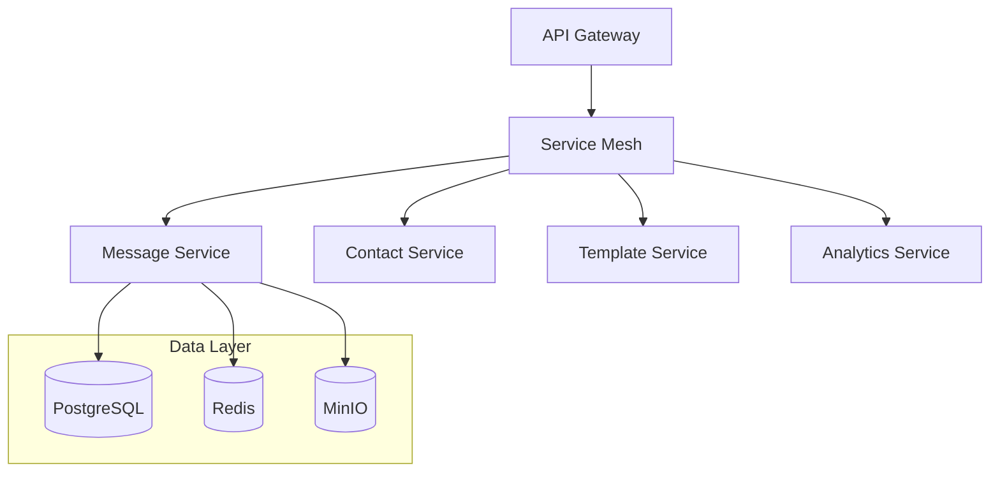

# WhatsApp Web Enhancement Application - Backend Services

## Overview

The WhatsApp Web Enhancement Application backend is a robust, enterprise-grade microservices architecture designed to extend WhatsApp Web's native capabilities for business users. This documentation provides comprehensive setup, configuration, and development guidelines for the backend services ecosystem.

## Table of Contents

- [Architecture](#architecture)
- [Prerequisites](#prerequisites)
- [Services](#services)
- [Getting Started](#getting-started)
- [Development](#development)
- [Deployment](#deployment)
- [Security](#security)
- [Troubleshooting](#troubleshooting)

## Architecture

The backend implements a microservices architecture pattern with the following key components:



### Service Communication
- **Protocol**: gRPC for inter-service communication
- **Message Queue**: Redis for event-driven architecture
- **Service Discovery**: Consul
- **Load Balancing**: Round-robin with health checks

## Prerequisites

### Required Software
- Docker Engine v24.0.0+
- Docker Compose v2.20.0+
- Node.js v20.0.0+ (LTS)
- Python v3.11.0+
- Go v1.21.0+
- Make (for build scripts)

### Development Tools
- Git v2.40.0+
- Visual Studio Code (recommended)
- Postman for API testing
- DBeaver for database management

## Services

### API Gateway (Node.js/Express)
- Port: 3000
- Purpose: Central request routing and authentication
- Features:
  - JWT authentication
  - Rate limiting
  - Request validation
  - API documentation (Swagger)

### Message Service (Go/Gin)
- Port: 8080
- Purpose: WhatsApp message processing
- Features:
  - High-performance message delivery
  - Template processing
  - Media handling
  - Queue management

### Contact Service (Python/FastAPI)
- Port: 8081
- Purpose: Contact management
- Features:
  - Contact CRUD operations
  - Group management
  - Import/export functionality
  - Contact validation

### Template Service (Node.js/Express)
- Port: 8082
- Purpose: Message template management
- Features:
  - Template CRUD operations
  - Variable validation
  - Version control
  - Preview generation

### Analytics Service (Python/FastAPI)
- Port: 8083
- Purpose: Business intelligence
- Features:
  - Real-time analytics
  - Report generation
  - Data aggregation
  - Export functionality

## Getting Started

1. Clone the repository:
```bash
git clone https://github.com/organization/whatsapp-web-enhancement.git
cd whatsapp-web-enhancement/backend
```

2. Copy environment template:
```bash
cp .env.example .env
```

3. Configure environment variables in `.env`

4. Start development environment:
```bash
docker-compose up -d
```

## Development

### Local Setup
```bash
# Install dependencies for all services
make install-deps

# Start development environment
make dev

# Run tests
make test

# Build services
make build
```

### Code Style
- Node.js: ESLint + Prettier
- Python: Black + isort
- Go: gofmt + golangci-lint

### Testing
- Unit tests: Jest (Node.js), pytest (Python), Go testing
- Integration tests: Postman collections
- Load testing: k6

## Deployment

### Environment Configuration

| Environment | Purpose | Infrastructure |
|-------------|---------|----------------|
| Development | Local development | Docker Compose |
| Staging | Integration testing | AWS EKS |
| Production | Live system | AWS EKS |
| DR | Disaster recovery | AWS EKS |

### Deployment Process
1. Build container images
2. Run security scans
3. Push to container registry
4. Deploy using ArgoCD
5. Run smoke tests
6. Monitor metrics

## Security

### Authentication
- JWT-based authentication
- OAuth 2.0 integration
- Role-based access control (RBAC)

### Encryption
- TLS 1.3 for transport
- AES-256 for data at rest
- Key rotation every 90 days

### Security Measures
- WAF protection
- Rate limiting
- Input validation
- SQL injection prevention
- XSS protection
- CSRF tokens

## Troubleshooting

### Common Issues
1. Service discovery failures
   - Check Consul status
   - Verify network connectivity
   - Validate service registration

2. Database connection issues
   - Verify credentials
   - Check connection limits
   - Validate network access

3. Message processing delays
   - Monitor queue length
   - Check service logs
   - Verify rate limits

### Logging
- Centralized logging with ELK stack
- Log levels: DEBUG, INFO, WARN, ERROR
- Structured logging format

### Monitoring
- Prometheus metrics
- Grafana dashboards
- Custom alerting rules

## Contributing

1. Fork the repository
2. Create feature branch
3. Commit changes
4. Create pull request
5. Wait for review

## License

Copyright © 2023 Organization Name. All rights reserved.

---

For additional information, contact: support@organization.com