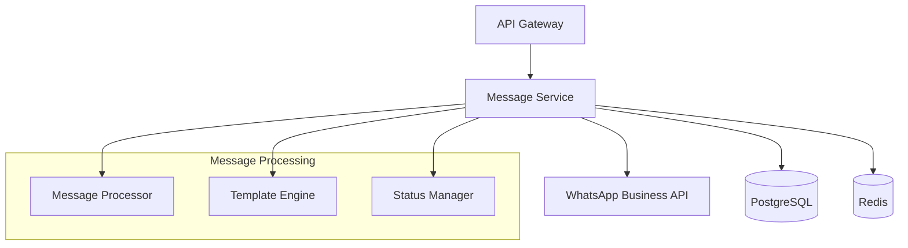

# WhatsApp Web Enhancement Message Service

A high-performance, enterprise-grade message processing service built in Go for handling WhatsApp message delivery, scheduling, and status management at scale.

## Overview

The Message Service is a core component of the WhatsApp Web Enhancement Application that provides:

- Bulk message processing and delivery
- Template-based messaging
- Message scheduling and automation
- Real-time status tracking
- High availability and fault tolerance
- Comprehensive monitoring and metrics

## Architecture

### Core Components



### Key Features

- **High Performance**: Processes 1000+ messages/second with parallel execution
- **Fault Tolerance**: Circuit breaker pattern with automatic retries
- **Scalability**: Horizontal scaling with message sharding
- **Monitoring**: Comprehensive metrics via Prometheus/Grafana
- **Security**: Enterprise-grade authentication and encryption

## Installation

### Prerequisites

- Go 1.21 or higher
- PostgreSQL 15.x
- Redis 7.2.x
- Prometheus 2.45.x
- Grafana 10.x

### Quick Start

1. Clone the repository:
```bash
git clone <repository-url>
cd src/backend/message-service
```

2. Install dependencies:
```bash
go mod download
```

3. Configure the service:
```bash
cp config.example.yaml config.yaml
# Edit config.yaml with your settings
```

4. Run the service:
```bash
go run cmd/message-service/main.go
```

## Configuration

The service uses a hierarchical configuration system supporting both YAML files and environment variables.

### Environment Variables

| Variable | Description | Default |
|----------|-------------|---------|
| MSG_SVC_SERVER_PORT | HTTP server port | 8080 |
| MSG_SVC_DATABASE_HOST | PostgreSQL host | localhost |
| MSG_SVC_REDIS_HOST | Redis host | localhost |
| MSG_SVC_WHATSAPP_API_KEY | WhatsApp API key | - |

### Configuration File (config.yaml)

```yaml
server:
  port: 8080
  host: "0.0.0.0"
  read_timeout: "30s"
  write_timeout: "30s"

database:
  host: "localhost"
  port: 5432
  name: "whatsapp_messages"
  max_open_conns: 25
  conn_max_lifetime: "15m"

whatsapp:
  api_endpoint: "https://api.whatsapp.com/v1"
  timeout: "30s"
  retry_attempts: 3
  retry_delay: "5s"

message_queue:
  batch_size: 100
  processing_interval: "5s"
  retry_limit: 3
```

## API Documentation

### Message Processing Endpoints

#### Send Message

```bash
POST /api/v1/messages
```

Request body:
```json
{
  "recipient_phone": "+1234567890",
  "content": {
    "text": "Hello, {name}!",
    "media_url": "https://example.com/image.jpg"
  },
  "template": {
    "name": "welcome_message",
    "language": "en",
    "components": [...]
  },
  "scheduled_at": "2023-12-01T15:00:00Z"
}
```

#### Batch Processing

```bash
POST /api/v1/messages/batch
```

Request body:
```json
{
  "messages": [
    {
      "recipient_phone": "+1234567890",
      "content": {...}
    },
    ...
  ]
}
```

## Monitoring

### Prometheus Metrics

| Metric | Type | Description |
|--------|------|-------------|
| message_service_processed_total | Counter | Total messages processed |
| message_service_processing_duration_seconds | Histogram | Message processing duration |
| message_service_active_batches | Gauge | Active batch operations |

### Health Check

```bash
GET /health
```

Response:
```json
{
  "status": "healthy",
  "version": "1.0.0",
  "metrics": {
    "active_batches": 2,
    "circuit_breaker_state": "closed"
  }
}
```

## Development

### Project Structure

```
message-service/
├── cmd/
│   └── message-service/
│       └── main.go
├── internal/
│   ├── config/
│   ├── models/
│   ├── repository/
│   └── services/
├── pkg/
│   └── whatsapp/
├── tests/
└── config.yaml
```

### Running Tests

```bash
go test ./... -v -race -cover
```

### Building for Production

```bash
docker build -t message-service:latest .
```

## High Availability Setup

The service supports high availability deployment with:

- Multiple service instances behind a load balancer
- Primary-replica database configuration
- Redis cluster for caching and queues
- Automatic failover and recovery
- Circuit breaker for external service calls

## Performance Optimization

- Connection pooling for database and Redis
- Batch processing for bulk operations
- Parallel message processing with bounded concurrency
- Efficient template rendering and caching
- Optimized database queries and indexes

## Security Considerations

- TLS encryption for all API endpoints
- JWT-based authentication
- Rate limiting per organization
- Input validation and sanitization
- Secure credential management
- Audit logging

## Contributing

1. Fork the repository
2. Create a feature branch
3. Commit your changes
4. Push to the branch
5. Create a Pull Request

## License

Copyright © 2023 WhatsApp Web Enhancement Application